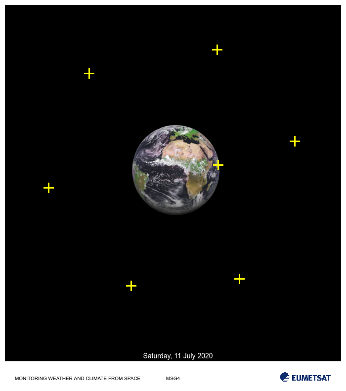

> ## Important Information
> You can view this page as a [webpage](https://numericalalgorithmsgroup.github.io/NAGJavaExamples/BXNL/orbit_ex) or access this as a regular github [repository](https://github.com/numericalalgorithmsgroup/NAGJavaExamples/tree/main/BXNL/orbit_ex).
>
> The source of this example can be found [here](https://github.com/numericalalgorithmsgroup/NAGJavaExamples/blob/main/BXNL/orbit_ex/source/OrbitEx.java) and the output [here](https://github.com/numericalalgorithmsgroup/NAGJavaExamples/blob/main/BXNL/orbit_ex/output.txt).
>
> See the top directory of this repository for instructions to set up the [NAG Library for Java](https://github.com/numericalalgorithmsgroup/NAGJavaExamples).

# Orbital Data Fitting

Example of a nonlinear least-square orbital data fitting. Given a set of orbital data points the task is to estimate an optimal orbit path that minimizes the error between the path and the fixed data points.

```java
    double[] tx = new double[] { 441.23, 484.31, 265.15, 98.25, 180.66, 439.13, 596.54 };
    double[] ty = new double[] { 333.92, 563.46, 577.40, 379.23, 148.62, 100.28, 285.99 };
    double[] cc = new double[] { 355.00, 347.00 };
    double[] tr = new double[tx.length];

    for (i = 0; i < tr.length; i++) {
        tr[i] = Math.pow(tx[i] - cc[0], 2) + Math.pow(ty[i] - cc[1], 2);
    }
```

<br/>

<div style="text-align: center;">
    
</div>

Image credit: [Image of Earth](https://pics.eumetsat.int/viewer/index.html) was taken from [EUMETSAT, Copyright 2020](https://pics.eumetsat.int/viewer/index.html#help).


The previous image shows the orbit measurements to which an optimal orbit, `r`, must be estimated. 
The simple univariate problem to solve is:

<div style="text-align: center;">
    
</div>

Here `tr[i]` contains the squared norm for the measurement point `i`, given by the coordinate pair `(tx[i], ty[i])`. Note that the coordinates for the center of the planet are provided by the vector `cc`.

```java
    // problem data
    // number of oservations
    int nres = tx.length;
    // observations
    //
    // number of parameter to fit
    int nvar = 1;
```

<br/>

```java
    // Define the least-square function and add first derivatives.
    /**
     * Objective function call back passed to the least squares solver. Return the
     * difference between the current estimated radius squared, r^2=x^2 and the
     * squared norm of the data point stored in tr[i] for i = 1 to nres:
     * rx[i] = r^2 - tr[i], i = 1, ..., nres.
     */
    public static class LSQFUN extends E04GG.Abstract_E04GG_LSQFUN {
        public void eval() {
            for (int i = 0; i < this.NRES; i++) {
                this.RX[i] = Math.pow(this.X[0], 2) - this.RUSER[i];
            }
        }
    }

    /**
     * Computes the Jacobian of the least square residuals. Simply return 
     * rdx[i] = 2r, i = 1, ..., nres.
     */
    public static class LSQGRD extends E04GG.Abstract_E04GG_LSQGRD {
        public void eval() {
            Arrays.fill(this.RDX, 2.0 * this.X[0]);
        }
    }
```

<br/>

```java
    // Initialize the model handle
    long handle = 0;
    int ifail = 0;

    E04RA e04ra = new E04RA();
    e04ra.eval(handle, nvar, ifail);

    handle = e04ra.getHANDLE();

    // Define a dense nonlinear least-squares objective function
    E04RM e04rm = new E04RM();
    ifail = 0;
    e04rm.eval(handle, nres, 0, 0, new int[] {}, new int[] {}, ifail);

    // Restrict parameter space (0 <= x)
    E04RH e04rh = new E04RH();
    double[] bl = new double[nvar];
    double[] bu = new double[nvar];
    Arrays.fill(bu, 1000.0);
    ifail = 0;
    e04rh.eval(handle, nvar, bl, bu, ifail);

    // Set some optional parameters to control the output of the solver
    E04ZM e04zm = new E04ZM();
    ifail = 0;

    e04zm.eval(handle, "Print Options = NO", ifail);
    e04zm.eval(handle, "Print Level = 1", ifail);
    e04zm.eval(handle, "Print Solution = X", ifail);
    e04zm.eval(handle, "Bxnl Iteration Limit = 100", ifail);

    // Define initial guess (starting point) Away from zero which is problematic
    double[] x = new double[nvar];
    Arrays.fill(x, 1.0);
```

Call the solver

```java
    // Call the solver
    E04GG e04gg = new E04GG();
    LSQFUN lsqfun = new LSQFUN();
    LSQGRD lsqgrd = new LSQGRD();
    LSQHES lsqhes = new LSQHES();
    LSQHPRD lsqhprd = new LSQHPRD();
    MONIT monit = new MONIT();
    double[] rx = new double[nres];
    double[] rinfo = new double[100];
    double[] stats = new double[100];
    int[] iuser = new int[0];
    double[] ruser = tr;
    long cpuser = 0;
    ifail = 0;

    e04gg.eval(handle, lsqfun, lsqgrd, lsqhes, lsqhprd, monit, nvar, x, nres, rx, rinfo, stats, iuser, ruser,
            cpuser, ifail);
```

<br/>

```
 E04GG, Nonlinear least squares method for bound-constrained problems
 Status: converged, an optimal solution was found
 Value of the objective             1.45373E+09
 Norm of projected gradient         2.23690E-01
 Norm of scaled projected gradient  4.14848E-06
 Norm of step                       3.75533E-06

 Primal variables:
   idx   Lower bound       Value       Upper bound
     1   0.00000E+00    2.38765E+02    1.00000E+03
```

<br/>

```java
    // Optimal parameter values
    double rstar = x[0];
    System.out.printf("Optimal Orbit Height: %3.2f\n", rstar);
```

<br/>

<div style="text-align: center;">
    
</div>

Suppose expert knowledge provides insight on the reliability of each measurement and that for this satellite configuration, operational orbit height should be around 250 +/-6 units. The previous image shows a fit where each measurement (data point) contributes the same amount and provides an optimal orbit height of 238.76 units. The fit is quite poor in the sense that it does not satisfy expert advice. Evidently data point 0 (yellow cross closest to Earth surface) is unreliable. Unreliability should be taken into account while doing the fitting. For this end, weights for each residuals are introduced (weights should be set to be proportional to the inverse of their variability). For this example, suppose we are provided with the accuracy for each of the data measurements. 

With this new information, the problem is solved again using weighted nonlinear least-squares.

```java
    // Add weights for each residual
    double[] weights = new double[] { 0.10, 0.98, 1.01, 1.00, 0.92, 0.97, 1.02 };
    double weights_sum = Arrays.stream(weights).sum();
    for (i = 0; i < weights.length; i++) {
        weights[i] /= weights_sum;
    }

    // Define the reliability of the measurements (weights)
    E04RX e04rx = new E04RX();
    ifail = 0;
    e04rx.eval(handle, "RW", 0, weights.length, weights, ifail);

    // Indicate to the solver that weights are to be used
    ifail = 0;
    e04zm.eval(handle, "Bxnl Use weights = Yes", ifail);

    // Define initial guess (starting point) Away from zero which is problematic
    Arrays.fill(x, 1.0);

    // Solve again
    e04gg.eval(handle, lsqfun, lsqgrd, lsqhes, lsqhprd, monit, nvar, x, nres, rx, rinfo, stats, iuser, ruser,
            cpuser, ifail);

    // Objective and solution
    rstar = x[0];
    System.out.printf("Optimal Orbit Height: %3.2f\n", rstar);
```

<br/>

```
 E04GG, Nonlinear least squares method for bound-constrained problems
 Status: converged, an optimal solution was found
 Value of the objective             1.25035E+06
 Norm of projected gradient         6.26959E-03
 Norm of scaled projected gradient  3.96468E-06
 Norm of step                       8.72328E-03

 Primal variables:
   idx   Lower bound       Value       Upper bound
     1   0.00000E+00    2.54896E+02    1.00000E+03
Optimal Orbit Height: 254.90
```

<br/>

<div style="text-align: center;">
    
</div>


```
Optimal Orbit Height: 254.90 (should be between 244 and 256)
```

For this weighted model the orbital solution provided concurs with expert advice.
