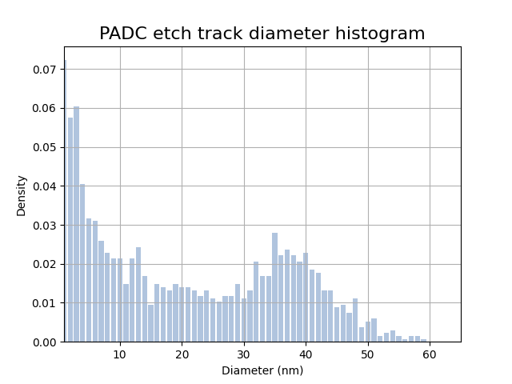
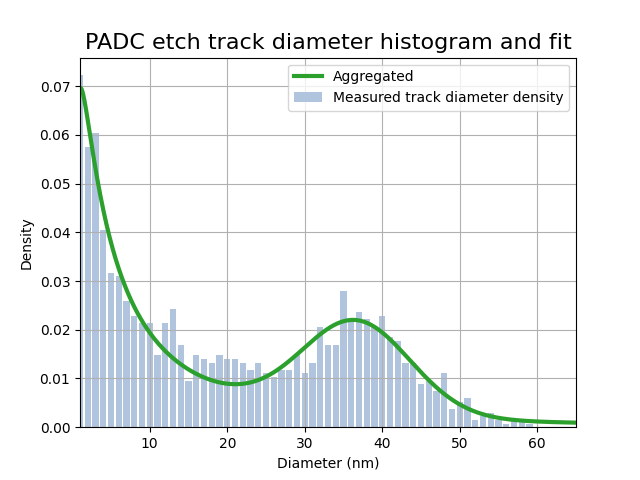
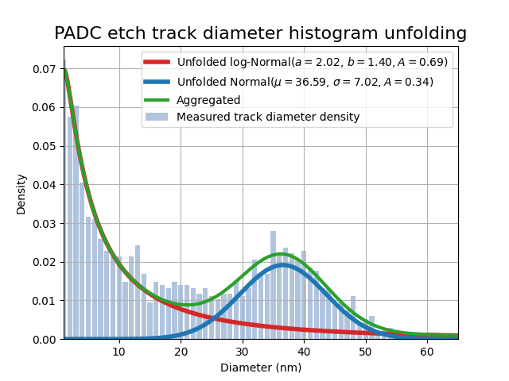

> ## Important Information
> This file has a lot of Latex and GitHub currently cannot render it on Markdown files. You can read all the math clearly as a [webpage](https://numericalalgorithmsgroup.github.io/NAGJavaExamples/BXNL/simple_BXNL) or access this as a regular github [repository](https://github.com/numericalalgorithmsgroup/NAGJavaExamples/tree/main/BXNL/simple_BXNL).
>
> The source of this example can be found [here](https://github.com/numericalalgorithmsgroup/NAGJavaExamples/blob/main/BXNL/simple_BXNL/source/SimpleBXNL.java) and the output [here](https://github.com/numericalalgorithmsgroup/NAGJavaExamples/blob/main/BXNL/simple_BXNL/output.txt).
>
> See the top directory of this repository for instructions to set up the [NAG Library for Java](https://github.com/numericalalgorithmsgroup/NAGJavaExamples).

This example demontrates how to fit data to a model using weighted nonlinear least-squares. 

**handle_solve_bxnl** (`e04gg`) is a bound-constrained nonlinear least squares trust region solver (BXNL) from the NAG optimization modelling suite aimed for small to medium-scale problems. It solves the problem:

$$
\begin{array}{ll}
{\underset{x \in \mathbb{R}^{n_{\text{var}}}}{minimize}\ } & 
\frac{1}{2} \sum_{i=1}^{n_{\text{res}}} w_i r_i(x)^2 + \frac{\sigma}{p}\|x\|^p_2\\
\text{subject to} & l_{x} \leq x \leq u_{x}
\end{array}
$$


where $$r_i(x),i=1,\dots,n_{\text{res}}$$, are smooth nonlinear functions called residuals, $$w_i ,i=1,\dots,n_{\text{res}}$$ are weights (by default they are all defined to 1, and the rightmost element represents the regularization term with parameter $$\sigma\geq0$$ and power $$p>0$$. The constraint elements $$l_x$$ and $$u_x$$ are $$n_{\text{var}}$$-dimensional vectors defining the bounds on the variables.

Typically in a calibration or data fitting context, the residuals will be defined as the difference between the observed values $$y_i$$ at $$t_i$$ and the values provided by a nonlinear model $$\phi(t;x)$$, i.e., $$r_i(x)≔y_i-\phi(t_i;x).$$

The following example illustrates the usage of `e04gg` to fit PADC target with $$\alpha$$ particle
etched nuclear track data to a convoluted distribution. A target
sheet is scanned and track diameters (red wedges in
the following Figure 1) are recorded into a histogram and a mixed Normal and log-Normal model is to be fitted to the experimental histogram (see Figure 2).

<div style="text-align: center;">
    
</div>

**Figure 1**: PADC with etched $$\alpha$$ particle tracks.

`e04gg` is used to fit the six parameter model
$$
\begin{array}{ll}
\phi\big(t, x = (a, b, A_{\ell}, \mu, \sigma, A_g)\big) = \text{log-Normal}(a, b, A_l) + \text{Normal}(\mu, \sigma^2, A_g)\\
\text{subject to } 0 \leq x,
\end{array}$$
using the histogram heights reported in Figure 2.

```java
    // problem data
    // number of observations
    int nres = 64;
    // ovservations
    int[] diameter = new int[nres];
    for (i = 0; i < nres; i++) {
        diameter[i] = i + 1;
    }
    double[] density = new double[] { 0.0722713864, 0.0575221239, 0.0604719764, 0.0405604720, 0.0317109145,
            0.0309734513, 0.0258112094, 0.0228613569, 0.0213864307, 0.0213864307, 0.0147492625, 0.0213864307,
            0.0243362832, 0.0169616519, 0.0095870206, 0.0147492625, 0.0140117994, 0.0132743363, 0.0147492625,
            0.0140117994, 0.0140117994, 0.0132743363, 0.0117994100, 0.0132743363, 0.0110619469, 0.0103244838,
            0.0117994100, 0.0117994100, 0.0147492625, 0.0110619469, 0.0132743363, 0.0206489676, 0.0169616519,
            0.0169616519, 0.0280235988, 0.0221238938, 0.0235988201, 0.0221238938, 0.0206489676, 0.0228613569,
            0.0184365782, 0.0176991150, 0.0132743363, 0.0132743363, 0.0088495575, 0.0095870206, 0.0073746313,
            0.0110619469, 0.0036873156, 0.0051622419, 0.0058997050, 0.0014749263, 0.0022123894, 0.0029498525,
            0.0014749263, 0.0007374631, 0.0014749263, 0.0014749263, 0.0007374631, 0.0000000000, 0.0000000000,
            0.0000000000, 0.0000000000, 0.0000000000 };

    // Define iuser and ruser to be passed to the callback functions
    int[] iuser = diameter;
    double[] ruser = density;
```

<br/>

<div style="text-align: center;">
    
</div>

**Figure 2**: Histogram of etched track diameter of $$\alpha$$ particles. Bar heights are the data that will be fitted unsing the aggregated model $$\phi(x, t)$$. 

```java
    // Define Normal and log-Normal distributions
    public static double lognormal(int d, double a, double b, double Al) {
        return Al / (d * b * Math.sqrt(2 * Math.PI)) * Math.exp(-(Math.pow(Math.log(d) - a, 2)) / (2 * Math.pow(b, 2)));
    }

    public static double gaussian(int d, double mu, double sigma, double Ag) {
        return Ag * Math.exp(-0.5 * Math.pow((d - mu) / sigma, 2)) / (sigma * Math.sqrt(2 * Math.PI));
    }

    public static double[] lognormal(double[] d, double a, double b, double Al) {
        double[] result = new double[d.length];
        for (int i = 0; i < d.length; i++) {
            result[i] = Al / (d[i] * b * Math.sqrt(2 * Math.PI)) * Math.exp(-(Math.pow(Math.log(d[i]) - a, 2)) / (2 * Math.pow(b, 2)));
        }
        return result;
    }

    public static double[] gaussian(double[] d, double mu, double sigma, double Ag) {
        double[] result = new double[d.length];
        for (int i = 0; i < d.length; i++) {
            result[i] = Ag * Math.exp(-0.5 * Math.pow((d[i] - mu) / sigma, 2)) / (sigma * Math.sqrt(2 * Math.PI));
        }
        return result;
    }
```

In terms of solving this problem, the function to minimize is the sum of residuals using the model $$\phi(x;t)$$
and the data pair (`diameter`, `density`). The parameter vector is $$x = (a, b, A_l, \mu, \sigma, A_g)$$. The next step is to define a function to return the residual vector 
$$\text{lsqfun}(x) := \big[r_1(x), r_2(x), \dots, r_{n_{\text{res}}}(x)\big]$$.

```java
    // Define the least-square function as a mixture of Normal and log-Normal
    // functions. Also add its first derivatives
    
    /**
     * Objective function callback passed to the least squares solver. x = (a, b,
     * Al, mu, sigma, Ag)
     */
    public static class LSQFUN extends E04GG.Abstract_E04GG_LSQFUN {
        public void eval() {
            int[] d = this.IUSER;
            double[] y = this.RUSER;
            double a = this.X[0];
            double b = this.X[1];
            double Al = this.X[2];
            double mu = this.X[3];
            double sigma = this.X[4];
            double Ag = this.X[5];

            for (int i = 0; i < this.NRES; i++) {
                this.RX[i] = lognormal(d[i], a, b, Al) + gaussian(d[i], mu, sigma, Ag) - y[i];
            }
        }
    }

    /**
     * Computes the Jacobian of the least square residuals. x = (a, b, Al, mu,
     * sigma, Ag)
     */
    public static class LSQGRD extends E04GG.Abstract_E04GG_LSQGRD {
        public void eval() {
            int n = this.X.length;
            int[] d = this.IUSER;
            double a = this.X[0];
            double b = this.X[1];
            double Al = this.X[2];
            double mu = this.X[3];
            double sigma = this.X[4];
            double Ag = this.X[5];
            for (int i = 0; i < this.NRES; i++) {
                // log-Normal derivatives
                double l = lognormal(d[i], a, b, Al);
                // dl/da
                this.RDX[i * n + 0] = (Math.log(d[i]) - a) / Math.pow(b, 2) * l;
                // dl/db
                this.RDX[i * n + 1] = (Math.pow(Math.log(d[i]) - a, 2) - Math.pow(b, 2)) / Math.pow(b, 3) * l;
                // dl/dAl
                this.RDX[i * n + 2] = lognormal(d[i], a, b, 1.0);
                // Gaussian derivatives
                double g = gaussian(d[i], mu, sigma, Ag);
                // dg/dmu
                this.RDX[i * n + 3] = (d[i] - mu) / Math.pow(sigma, 2) * g;
                // dg/dsigma
                this.RDX[i * n + 4] = (Math.pow(d[i] - mu, 2) - Math.pow(sigma, 2)) / Math.pow(sigma, 3) * g;
                // dg/dAg
                this.RDX[i * n + 5] = gaussian(d[i], mu, sigma, 1.0);
            }
        }
    }
```

<br/>

```java
    // parameter vector: x = (a, b, Al, mu, sigma, Ag)
    int nvar = 6;

    // Initialize the model handle
    E04RA e04ra = new E04RA();
    long handle = 0;
    int ifail = 0;
    e04ra.eval(handle, nvar, ifail);

    handle = e04ra.getHANDLE();

    // Define a dense nonlinear least-squares objective function
    E04RM e04rm = new E04RM();
    ifail = 0;
    e04rm.eval(handle, nres, 0, 0, new int[] {}, new int[] {}, ifail);

    // Add weights for each residual
    double[] weights = new double[nres];
    Arrays.fill(weights, 1.0);
    for (i = 55; i < 63; i++) {
        weights[i] = 5.0;
    }
    double weights_sum = Arrays.stream(weights).sum();
    for (i = 0; i < weights.length; i++) {
        weights[i] /= weights_sum;
    }

    // Define the reliability of the measurements (weights)
    E04RX e04rx = new E04RX();
    ifail = 0;
    e04rx.eval(handle, "RW", 0, weights.length, weights, ifail);

    // Restrict parameter space (0 <= x)
    E04RH e04rh = new E04RH();
    double[] bl = new double[nvar];
    double[] bu = new double[nvar];
    Arrays.fill(bu, 100.0);
    ifail = 0;
    e04rh.eval(handle, nvar, bl, bu, ifail);

    // Set some optional parameters to control the output of the solver
    E04ZM e04zm = new E04ZM();
    ifail = 0;

    e04zm.eval(handle, "Print Options = NO", ifail);
    e04zm.eval(handle, "Print Level = 1", ifail);
    e04zm.eval(handle, "Print Solution = X", ifail);
    e04zm.eval(handle, "Bxnl Iteration Limit = 100", ifail);
    // Add cubic regularization term (avoid overfitting)
    e04zm.eval(handle, "Bxnl Use weights = YES", ifail);
    e04zm.eval(handle, "Bxnl Reg Order = 3", ifail);
    e04zm.eval(handle, "Bxnl Glob Method = REG", ifail);

    // Define initial guess (starting point)
    double[] x = new double[] { 1.63, 0.88, 1.0, 30, 1.52, 0.24 };
```

Call the solver

```java
    // Call the solver
    E04GG e04gg = new E04GG();
    LSQFUN lsqfun = new LSQFUN();
    LSQGRD lsqgrd = new LSQGRD();
    LSQHES lsqhes = new LSQHES();
    LSQHPRD lsqhprd = new LSQHPRD();
    MONIT monit = new MONIT();
    double[] rx = new double[nres];
    double[] rinfo = new double[100];
    double[] stats = new double[100];
    long cpuser = 0;
    ifail = 0;

    e04gg.eval(handle, lsqfun, lsqgrd, lsqhes, lsqhprd, monit, nvar, x, nres, rx, rinfo, stats, iuser, ruser,
            cpuser, ifail);
```

<br/>

```
 E04GG, Nonlinear least squares method for bound-constrained problems           
 Status: converged, an optimal solution was found                                                   
 Value of the objective             4.44211E-08                                                     
 Norm of projected gradient         1.18757E-09                                                     
 Norm of scaled projected gradient  3.98428E-06                                                     
 Norm of step                       1.66812E-01                                                     
                                                                                
 Primal variables:                                                              
   idx   Lower bound       Value       Upper bound                              
     1   0.00000E+00    2.02043E+00    1.00000E+02                              
     2   0.00000E+00    1.39726E+00    1.00000E+02                              
     3   0.00000E+00    6.93255E-01    1.00000E+02                              
     4   0.00000E+00    3.65929E+01    1.00000E+02                              
     5   0.00000E+00    7.01808E+00    1.00000E+02                              
     6   0.00000E+00    3.36877E-01    1.00000E+02 
```

The optimal solution $$x$$ provides the unfolded parameters for the two distributions, Normal and log-Normal (blue and red curves in Figure 4). Adding these together produces the aggragated curve (shown in color green of Figure 3 and 4) this last one is the one used to perform the fitting with. The optimal solution is

```java
    // Optimal parameter values
    // Al * log-Normal(a, b):
    double aopt = x[0];
    double bopt = x[1];
    double Alopt = x[2];

    // Ag * gaussian(mu, sigma):
    double muopt = x[3];
    double sigmaopt = x[4];
    double Agopt = x[5];
```

and the objective function value is

```
Objective Function Value: 4.4421102582032467E-8
```

The next plot in Figure 3 illustrates the mixed-distribution fit over the histogram:

<div style="text-align: center;">
    
</div>

**Figure 3**: Histogram with aggregated fit.

The plot below in Figure 4 shows the unfolded fit, in red the log-Normal distribution and blue the Normal one:

<div style="text-align: center;">
    
</div>

**Figure 4**: Aggregated model used for the fitting (green curve) and unfolded models (blue and red curves).
Optimal parameter values are ported in the legend.

Finally, clean up and destroy the handle

```java
    // Destroy the handle:
    E04RZ e04rz = new E04RZ();
    ifail = 0;
    e04rz.eval(handle, ifail);
```
