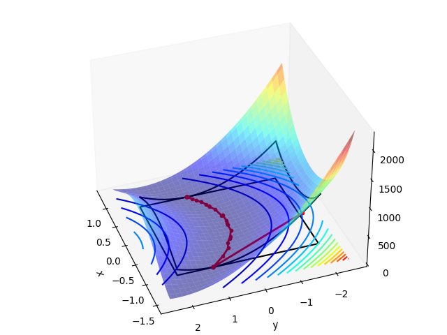

> ## Important Information
> You can view this page as a [webpage](https://numericalalgorithmsgroup.github.io/NAGJavaExamples/FOAS/example) or access this as a regular github [repository](https://github.com/numericalalgorithmsgroup/NAGJavaExamples/tree/main/FOAS/example).
>
> The source of this example can be found [here](https://github.com/numericalalgorithmsgroup/NAGJavaExamples/tree/main/FOAS/example/Rosenbrock2d.java) and the output [here](https://github.com/numericalalgorithmsgroup/NAGJavaExamples/tree/main/FOAS/example/output.txt).
>
> See the top directory of this repository for instructions to set up the [NAG Library for Java](https://github.com/numericalalgorithmsgroup/NAGJavaExamples).

# Rosenbrock function: Bound constrained optimization
First order active set bound-constrained nonlinear programming

2d Rosenbrock example: This page illustrates the usage of FOAS to solve the bound-constrained 2d Rosenbrock function. There is a plot at the end showing the steps taken by the solver to find the solution point.

Add objective function, gradient and monitoring callback

```java
/**
 * The objective's function.
 */
public static class OBJFUN extends E04KF.Abstract_E04KF_OBJFUN {
    public void eval() {
        this.FX = objfunEval(this.X[0], this.X[1]);
    }
}

/**
 * The objective's gradient.
 */
public static class OBJGRD extends E04KF.Abstract_E04KF_OBJGRD {
    public void eval() {
        this.FDX[0] = 2.0 * this.X[0] - 400.0 * this.X[0] * (this.X[1] - Math.pow(this.X[0], 2)) - 2.0;
        this.FDX[1] = 200.0 * (this.X[1] - Math.pow(this.X[0], 2));
    }
}

/**
 * The monitor function.
 */
public static class MONIT extends E04KF.Abstract_E04KF_MONIT {
    public void eval() {
        steps[0].add(this.X[0]);
        steps[1].add(this.X[1]);
        steps[2].add(this.RINFO[0]);
    }
}
```

Specify initial guess

```java
double[] x = new double[] { -1.0, -1.5 };
```

Define the nonlinear objective (add to handle)

```java
E04RA e04ra = new E04RA();
E04RG e04rg = new E04RG();
E04RH e04rh = new E04RH();
E04ZM e04zm = new E04ZM();
E04KF e04kf = new E04KF();

ifail = 0;
e04ra.eval(handle, nvar, ifail);
handle = e04ra.getHANDLE();

ifail = 0;
e04rg.eval(handle, nvar, idxfd, ifail);
```

Add the box bounds on the variable x to the handle

```java
double[] bl = new double[] { -1.0, -2.0 };
double[] bu = new double[] { 0.8, 2.0 };
ifail = 0;
e04rh.eval(handle, nvar, bl, bu, ifail);
```

Set some algorithmic options

```java
ifail = 0;
e04zm.eval(handle, "FOAS Print Frequency = 1", ifail);
e04zm.eval(handle, "Print Solution = yes", ifail);
e04zm.eval(handle, "FOAS Monitor Frequency = 1", ifail);
e04zm.eval(handle, "Print Level = 2", ifail);
e04zm.eval(handle, "Monitoring Level = 1", ifail);
```

Solve the problem

```java
OBJFUN objfun = new OBJFUN();
OBJGRD objgrd = new OBJGRD();
MONIT monit = new MONIT();
double[] rinfo = new double[100];
double[] stats = new double[100];
int[] iuser = new int[0];
double[] ruser = new double[0];
long cpuser = 0;
ifail = 0;
e04kf.eval(handle, objfun, objgrd, monit, nvar, x, rinfo, stats, iuser, ruser, cpuser, ifail);

// Add last step
steps[0].add(x[0]);
steps[1].add(x[1]);
steps[2].add(rinfo[0]);
```

<br/>

```                                                                             
 ----------------------------------------------------------                     
  E04KF, First order method for bound-constrained problems                      
 ----------------------------------------------------------                     
                                                                                
 Begin of Options                                                               
     Print File                    =                   6     * d                
     Print Level                   =                   2     * U                
     Print Options                 =                 Yes     * d                
     Print Solution                =                 All     * U                
     Monitoring File               =                  -1     * d                
     Monitoring Level              =                   1     * U                
     Foas Monitor Frequency        =                   1     * U                
     Foas Print Frequency          =                   1     * U                
 
     Infinite Bound Size           =         1.00000E+20     * d                
     Task                          =            Minimize     * d                
     Stats Time                    =                  No     * d                
     Time Limit                    =         1.00000E+06     * d                
     Verify Derivatives            =                  No     * d                
 
     Foas Estimate Derivatives     =                  No     * d                
     Foas Finite Diff Interval     =         1.05367E-08     * d                
     Foas Iteration Limit          =            10000000     * d                
     Foas Memory                   =                  11     * d                
     Foas Progress Tolerance       =         1.08158E-12     * d                
     Foas Rel Stop Tolerance       =         1.08158E-12     * d                
     Foas Restart Factor           =         6.00000E+00     * d                
     Foas Slow Tolerance           =         1.01316E-02     * d                
     Foas Stop Tolerance           =         1.00000E-06     * d                
     Foas Tolerance Norm           =            Infinity     * d                
 End of Options                                                                 
                                                                                
 Problem Statistics                                                                                                                                                                                     
   No of variables                  2                                                                                                                                                                   
     free (unconstrained)           0                                                                                                                                                                   
     bounded                        2                                                                                                                                                                   
   Objective function       Nonlinear                                                                                                                                                                   
                                                                                                                                                                                                        
                                                                                                    
 -------------------------------------------------------------------------------                    
   iters |  objective |  optim  |   dir                                                             
 -------------------------------------------------------------------------------                    
        0  6.29000E+02  5.00E+02  3.50E+00                                                          
        1  6.29000E+02  5.00E+02  3.50E+00                                                          
        2  4.00000E+00  0.00E+00  1.80E+00                                                          
        3  4.00000E+00  0.00E+00  1.80E+00                                                          
        4  3.99156E+00  2.80E+00  2.80E+00                                                          
        5  3.99156E+00  2.80E+00  2.80E+00                                                          
        6  3.98433E+00  1.44E+00  1.44E+00                                                          
        7  3.97076E+00  5.76E+00  1.79E+00                                                          
        8  3.41157E+00  1.66E+01  1.60E+00                                                          
        9  3.15876E+00  2.07E+01  1.65E+00                                                          
       10  2.34744E+00  2.55E+00  2.29E+00                                                          
       11  2.06122E+00  5.09E+00  1.83E+00                                                          
       12  1.97065E+00  6.49E+00  1.88E+00                                                          
       13  1.77751E+00  9.58E+00  1.99E+00                                                          
       14  1.19453E+00  2.20E+00  8.93E-01                                                          
       15  1.12429E+00  2.33E+00  2.01E+00                                                          
       16  1.01998E+00  5.04E+00  2.02E+00                                                          
       17  8.94996E-01  8.97E+00  2.02E+00                                                          
       18  7.06184E-01  1.32E+00  1.10E+00                                                          
       19  5.06340E-01  5.11E+00  1.91E+00                                                          
 -------------------------------------------------------------------------------                    
   iters |  objective |  optim  |   dir                                                             
 -------------------------------------------------------------------------------                    
       20  3.21115E-01  1.03E+00  3.67E-01                                                          
       21  2.99551E-01  9.31E-01  9.31E-01                                                          
       22  2.51003E-01  2.68E+00  1.75E+00                                                          
       23  2.14196E-01  4.82E+00  1.66E+00                                                          
       24  1.15236E-01  1.17E+00  3.70E-01                                                          
       25  8.06733E-02  1.98E+00  1.73E+00                                                          
       26  6.60815E-02  4.33E+00  1.79E+00                                                          
       27  5.37636E-02  3.33E+00  1.80E+00                                                          
       28  4.02960E-02  3.44E-01  3.44E-01                                                          
       29  4.02960E-02  3.44E-01  3.44E-01                                                          
       30  4.00937E-02  1.94E-01  1.94E-01                                                          
       31  4.00937E-02  1.94E-01  1.94E-01                                                          
       32  4.00000E-02  0.00E+00  0.00E+00                                                          
 -------------------------------------------------------------------------------                    
 Status: converged, an optimal solution was found                                                   
 -------------------------------------------------------------------------------                    
 Value of the objective             4.00000E-02                                                     
 Norm of inactive gradient          0.00000E+00                                                     
 Norm of projected direction        0.00000E+00                                                     
 Iterations                                  32                                                     
 Function evaluations                        75                                                     
 FD func. evaluations                         0                                                     
 Gradient evaluations                        36                                                     
   NPG function calls                        18                                                     
   NPG gradient calls                         3                                                     
   CG function calls                          9                                                     
   CG gradient calls                          5                                                     
   LCG function calls                        48                                                     
   LCG gradient calls                        28                                                     
 -------------------------------------------------------------------------------                    
                                                                                
 Primal variables:                                                              
   idx   Lower bound       Value       Upper bound                              
     1  -1.00000E+00    8.00000E-01    8.00000E-01                              
     2  -2.00000E+00    6.40000E-01    2.00000E+00                              
                                                                                
 Box bounds dual variables:                                                     
   idx   Lower bound       Value       Upper bound       Value                  
     1  -1.00000E+00    0.00000E+00    8.00000E-01    4.00000E-01               
     2  -2.00000E+00    0.00000E+00    2.00000E+00    0.00000E+00               
     
```

Retrieve Lagrange multipliers

```java
double[] mult = new double[2 * nvar];
Arrays.fill(mult, 0.0);

E04RX e04rx = new E04RX();
ifail = 0;
e04rx.eval(handle, "Dual Variables", 1, 2 * nvar, mult, ifail);

double[] mult_t = new double[mult.length / 2];
for (int i = 0; i < mult.length; i += 2) {
    mult_t[i / 2] = mult[i] - mult[i + 1];
}
```

<br/>

```
Lagrange multipliers: [ -0.4 0.0 ]
```

Destroy the handle

```java
E04RZ e04rz = new E04RZ();
e04rz.eval(handle, ifail);
```

Evaluate the funtion over the domain

```java
double[] x_m = linspace(bl[0] - 0.5, bu[0] + 0.5, 101);
double[] y_m = linspace(bl[1] - 0.5, bu[1] + 0.5, 101);
double[][] z_m = new double[101][101];

for (int i = 0; i < 101; i++) {
    for (int j = 0; j < 101; j++) {
        z_m[i][j] = objfunEval(x_m[i], y_m[i]);
    }
}
int inform = 1;

int nb = 25;
double[] x_box = linspace(bl[0], bu[0], nb);
double[] y_box = linspace(bl[1], bu[1], nb);

double[][] box = new double[2][100];

for (int i = 0; i < nb; i++) {
    box[0][i] = x_box[i];
    box[0][nb + i] = bu[0];
    box[0][nb * 2 + i] = x_box[nb - 1 - i];
    box[0][nb * 3 + i] = bl[0];

    box[1][i] = bl[1];
    box[1][nb + i] = y_box[i];
    box[1][nb * 2 + i] = bu[1];
    box[1][nb * 3 + i] = y_box[nb - 1 - i];
}

double[] z_box = new double[box[0].length];

for (int i = 0; i < z_box.length; i++) {
    z_box[i] = objfunEval(box[0][i], box[1][i]);
}

double[][] X = new double[x_m.length][x_m.length];
double[][] Y = new double[y_m.length][y_m.length];

for (int i = 0; i < X.length; i++) {
    Arrays.fill(X[i], x_m[i]);
    Arrays.fill(Y[i], y_m[i]); 
}
```

Plot function and steps taken

<div style="text-align: center;">
    
</div>
