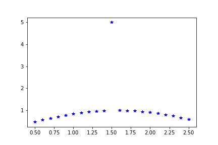
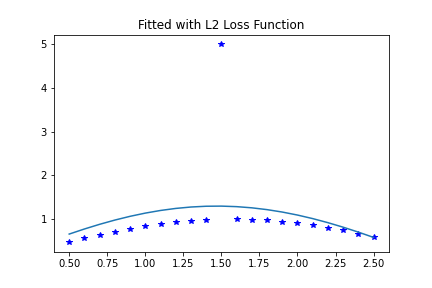
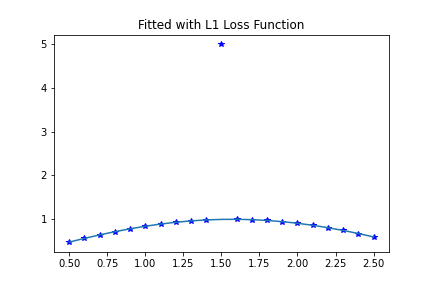
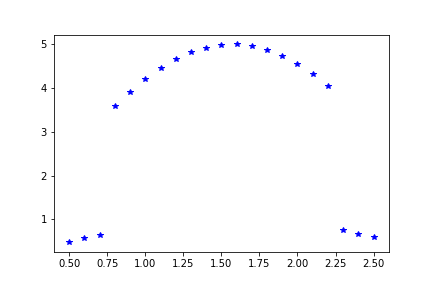
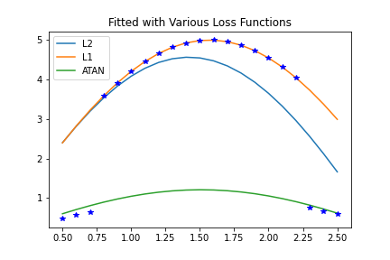
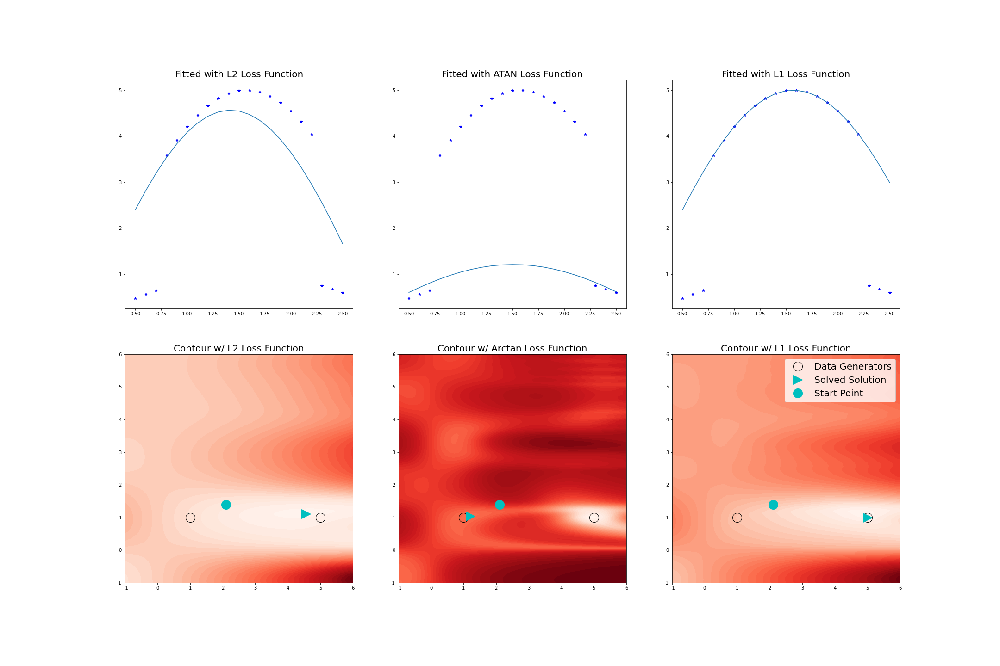

> ## Important Information
> This file has a lot of Latex and GitHub currently cannot render it on Markdown files. You can read all the math clearly as a [webpage](https://caleb-hamilton.github.io/NAGJavaExamples/NLDF/) or access this as a regular github [repository](https://github.com/caleb-hamilton/NAGJavaExamples/tree/main/NLDF).
>
> See the top directory of this repository for instructions to set up the [NAG Library for Java](https://github.com/caleb-hamilton/NAGJavaExamples).

# Loss Function and Robustness in Data-Fitting

## Technical Setup

### NAG Library Install

To run this example, you will need to install the NAG Library (Mark 28.5 or newer) and a license key. You will also need the NAG Library for Java wrappers. You can find the software, wrappers, and request a license key from our website here: [Getting Started with NAG Library](https://www.nag.com/content/getting-started-nag-library)

### Using These Example Files

This directory contains a Java source code and a couple images files to help illustrate this example. With NAG Library and wrappers properly installed, the Java file can be compiled and run as it is to produce a data set and execute all the example scenarios described below.


## Introduction
Fitting a non-linear model to data is typically modelled as a minimisation problem, where the objective function serves as a measurement of the quality of the model’s fit to data, depending on our parameters. A general model involves summing over our data points,

$$
\underset{x \in \mathbb{R}^{n_{\text{var}}}}{\text{minimize}} ~f(x) =\sum_{i=1}^{n_{\text{res}}} \chi(r_i(x)),
$$

where $$x$$ is a vector holding our model parameters, of which there are $$n_\text{var}$$. We have $$n_\text{res}$$ data points, and $$r_i(x)= y_i - \varphi(t_i;x), \quad i = 1,...,n_\text{res}$$ is the $$i^{th}$$ residual, equal to the difference between the observed and predicted values of the independent variable at time $$t_i$$, denoted $$y_i$$ and $$\varphi(t_i;x)$$ respectively. The loss function $$\chi$$ has desirable properties such as being bounded from below, and increasing with $$\|{r_i\left(x\right)}\|$$. Summing over all data points then, the objective function will be small when the model fits the whole dataset well, which is what we want.

There are plenty of choices for function $$\chi$$, so how does our choice of loss function affect the fit we end up with? One important consideration is robustness. If some of the observed data points are far from the fitted model, how can we control the influence of those outliers? A robust loss function is one which doesn’t get thrown off easily by outliers in the data.

### Java Imports
The packages we need to import for this example consist entirely of the following.
```java
import com.nag.routines.E04.E04GN; // nagf_opt_handle_solve_nldf
import com.nag.routines.E04.E04GNU; // monit
import com.nag.routines.E04.E04GNX; // confun dummy
import com.nag.routines.E04.E04GNY; // congrd dummy
import com.nag.routines.E04.E04RA; // Handle init
import com.nag.routines.E04.E04RH; //box bounds
import com.nag.routines.E04.E04RJ; // linear constraints
import com.nag.routines.E04.E04RM; // add model and residual sparsity structure
import com.nag.routines.E04.E04RZ; //destroy handle
import com.nag.routines.E04.E04ZM; // optional parameters

import java.lang.Math;
import java.util.Arrays;
```

### Utility Functions and Setup
We need to define a few dummy functions required by the Generalized Data Fitting solver interface
```java
private static class CONFUN extends E04GNX implements E04GN.E04GN_CONFUN {
    public void eval(){
        super.eval();
    }
}

private static class CONGRD extends E04GNY implements E04GN.E04GN_CONGRD {
    public void eval(){
        super.eval();
    }
}

private static class MONIT extends E04GNU implements E04GN.E04GN_MONIT {
    public void eval(){
        super.eval();
    }
}
```

Inside our 'main', we will initialize all our variables and create our handle.
```java
        E04GN e04gn = new E04GN(); // the solver
        E04RA e04ra = new E04RA(); // the handle initializer
        E04RM e04rm = new E04RM(); // for setting model and residual sparsity structure
        E04ZM e04zm = new E04ZM(); // for setting optional parameters
        E04RZ e04rz = new E04RZ(); // handle destroyer


        MONIT monit = new MONIT(); // defined below using E04GNU
        CONFUN confun = new CONFUN(); // defined below using E04GNX (dummy)
        CONGRD congrd = new CONGRD(); // defined below using E04GNY (dummy)
        
                double [] x = new double [2]; // instatiate an array for as many variable you need 
        long handle = 0;
        int nvar = x.length;
        int ifail;
        int nres = t.length;

        // Init for sparsity structure
        int isparse = 0;
        int nnzrd = 0;
        int [] irowrd = new int [nnzrd];
        int [] icolrd = new int [nnzrd];

        // Get handle
        ifail = 0;
        e04ra.eval(handle, nvar, ifail);
        handle = e04ra.getHANDLE();

        // define the residual functions and sparsity structure
        ifail = 0;
        e04rm.eval(handle, nres, isparse, nnzrd, irowrd, icolrd, ifail);

        // Set options
        ifail = 0;
        e04zm.eval(handle, "NLDF Loss Function Type = L2", ifail);
        e04zm.eval(handle, "Print Level = 1", ifail);
        e04zm.eval(handle, "Print Options = No", ifail);
        e04zm.eval(handle, "Print Solution = Yes", ifail);

        // Initialize all the remaining parameters
        LSQFUN lsqfun = new LSQFUN();
        LSQGRD lsqgrd = new LSQGRD();
        double [] rx = new double[nres];
        double [] rinfo = new double[100];
        double [] stats = new double [100];
        int [] iuser = new int[0];
        long cpuser = 0;
```

We also define $$t$$ as an array of 21 points from $$0.5$$ to $$2.5$$.
 
## Single-outlier example

To investigate the robustness aspect, here’s a toy dataset which is generated from $$\sin(t)$$ and has an outlier at $$t=1.5$$, which is generated by $$5\sin(t)$$.



```java
private static double[] toydata1(double [] t) {
    double [] y = new double[t.length * 2];
    for(int i = 0; i < t.length * 2; i++){
        if(i < t.length){
            y[i] = t[i];
        }
        else{
            y[i] = Math.sin(t[i-t.length]);
            if(i -  t.length == 10){
                y[i] = 5 * y[i];
            }
        }
    }
    return y;
}
````

We will fit it with a model 

$$
\varphi(t;x)\ =x_1\sin(x_2t)
$$

using a variety of loss functions provided by NAG’s data-fitting solver **handle_solve_nldf** (`e04gn`), which constructs the appropriate objective function for us.

To set up this model, we must define it and its gradient inside the functions `LSQFUN` and `LSQGRD`
```java
private static class LSQFUN extends E04GN.Abstract_E04GN_LSQFUN {
    public void eval() {
        for(int i = 0; i < NRES; i++){
             this.RX[i] = RUSER[NRES + i] - X[0] * Math.sin(X[1] * RUSER[i]);
        }
    }
}

private static class LSQGRD extends E04GN.Abstract_E04GN_LSQGRD {
    public void eval() {
        for(int i = 0; i < NRES; i++){
            this.RDX[i * NVAR] = (-1 * Math.sin(X[1]*RUSER[i]));
            this.RDX[i* NVAR + 1] = (-1 * RUSER[i] * X[0] * Math.cos(X[1] * RUSER[i]));
        }
    }
}
```

### Start with $$l_2$$-norm loss function - Example 1
Starting with one of the most common loss functions, the $$l_2$$-norm, we form the problem

$$
\underset{x \in \mathbb{R}^{2}}{\text{minimize}}~f(x) =\sum_{i=1}^{21} r_i(x)^2
$$

which is just least squares regression. $$l_2$$-norm loss has low robustness against outliers, so we should expect that the solution will be affected heavily by this one outlier. Let’s solve from a starting point at

$$
x\ =\ (2.1,1.4)
$$

to see what this outlier does to the minimum.

For this Java example, we set up a function to reset $$x$$ variable to the starting point, since it gets passed to the solver and returns the solution.

```java
private static double[] init_x() {
    double [] x = new double [] {2.1,1.4};
    return x;
}
```
We first set up the options parameter to select the loss function and the printing options.

Since we already set up the handle and initialized the loss function to $$l2$$, we can just set our initial guess and solve.

```java
ifail = 0;
x = init_x();
e04gn.eval(handle, lsqfun, lsqgrd, confun, congrd, monit, nvar, x, nres, rx, rinfo,
    stats, iuser, ruser1, cpuser, ifail);
```

This first solve will print out the solution:
```
E04GN, Nonlinear Data-Fitting
Status: converged, an optimal solution found
Final objective value  1.470963E+01

Primal variables:
  idx   Lower bound       Value       Upper bound
    1       -inf       1.30111E+00         inf
    2       -inf       1.06956E+00         inf
````

And the curve this produces looks like this:
 


The single outlier was able to disrupt the fit, since $$l_2$$-norm loss makes outliers contribute heavily to the objective function and search direction.

### Try $$l_1$$-norm loss function - Example 2
Using $$l_1$$-norm loss gives us the problem

$$
\underset{x \in \mathbb{R}^{2}}{\text{minimize}}~f(x) =\sum_{i=1}^{21} |r_i(x)|,
$$

which is more robust against outliers. This means if some large portion of the data is well-fitted by some solution $$x^\ast$$, there is likely to be a local minimum very close to $$x^\ast$$ which is relatively undisturbed by the remaining data that is outlying to the solution $$x^\ast$$. Here’s the solution, again starting at $$x=(2.1,1.4)$$, using $$l_1$$ loss.

Now all we need to do is change the loss function parameter, reset $$x$$, and solve again.
```java
ifail = 0;
x = init_x();
e04zm.eval(handle, "NLDF Loss Function Type = L1", ifail);
e04gn.eval(handle, lsqfun, lsqgrd, confun, congrd, monit, nvar, x, nres, rx, rinfo,
    stats, iuser, ruser1, cpuser, ifail);
```

The results of this solve look like this:
```
E04GN, Nonlinear Data-Fitting
Status: converged, an optimal solution found
Final objective value  3.989980E+00

Primal variables:
  idx   Lower bound       Value       Upper bound
    1       -inf       1.00000E+00         inf
    2       -inf       1.00000E+00         inf
```



Clearly, this is a much better fit for most of the data, and the outlier hasn’t dragged the model off most of the data.

## The trade-off of a loss function

We can reuse the handle, the residual function (and gradient). Just changing the data and options, we can demonstrate more principles to consider regarding loss functions.

There is a danger in choosing a very robust loss function. During an iterative optimization process, a loss function which is robust against outliers will usually prefer the data which is close to the current model. This means that if the algorithm finds local minima of the objective function, the search can fall into a local minimum when the model fits some subset of the data very well but fits the majority of the data very badly.

To illustrate this, here’s a new dataset which we will try to fit with the same model, again starting at $$x= (2.1,1.4)$$. Most of the data was generated by $$5\sin(t)$$, with the 3 data points at either end being generated by $$\sin(t)$$.



```java
private static double[] toydata2(double [] t) {
    double [] y = new double[t.length * 2];
    for(int i = 0; i < t.length * 2; i++){
        if(i < t.length){
            y[i] = t[i];
       }
       else{
           y[i] = Math.sin(t[i-t.length]);
           if((i -  t.length >= 3) && (i - t.length < 18)){
               y[i] = 5 * y[i];
           }
       }
    }
    return y;
}
```

We will fit this data set using 3 different loss functions with the same model $$\varphi(t;x)$$ each time and discuss the results under the plots all at once below.

```java
ifail = 0;
x = init_x();
e04zm.eval(handle, "NLDF Loss Function Type = L2", ifail);
e04gn.eval(handle, lsqfun, lsqgrd, confun, congrd, monit, nvar, x, nres, rx, rinfo,
    stats, iuser, ruser2, cpuser, ifail);

ifail = 0;
x = init_x();
e04zm.eval(handle, "NLDF Loss Function Type = L1", ifail);
e04gn.eval(handle, lsqfun, lsqgrd, confun, congrd, monit, nvar, x, nres, rx, rinfo,
    stats, iuser, ruser2, cpuser, ifail);

ifail = 0;
x = init_x();
e04zm.eval(handle, "NLDF Loss Function Type = ATAN", ifail);
e04gn.eval(handle, lsqfun, lsqgrd, confun, congrd, monit, nvar, x, nres, rx, rinfo,
    stats, iuser, ruser2, cpuser, ifail);
```

Here are all the curves plotted together:



In the first row of plots, the data is fitted using $$l_2$$-norm loss, $$l_1$$-norm loss, and $$\arctan$$ loss. Shown below each is the contour plot of the objective function value, where the black circles represent the parameters used to generate the data, the cyan circles represents the starting point for the solver, and the cyan wedges represent the optimized solution found by the solver.



In the $$l_2$$-norm case in the left column, the outliers generated by $$\sin(t)$$ have pulled the optimal solution away from $$x = (5,1)$$. The contour plot for $$l_2$$-norm loss indicates that we don’t have to worry too much about what starting point to use, since there are no local minima in the region displayed, other than global best solution.

The behaviour of the solver is quite different when using an extremely robust loss function like $$\arctan$$ loss, which looks like

$$
\underset{x \in \mathbb{R}^{2}}{\text{minimize}} ~ f(x) =\sum_{i=1}^{21} \text{arctan}(r_i(x)^2)
$$

The fitted model and corresponding contour plot for the $$\arctan$$ case are in the middle. Here, there are eight local minima in the contour plot for $$\arctan$$ loss, with seven of them being substantially worse solutions than the global minimum, and it is one of these we’ve converged to. Therefore, in this case the selection of initial estimation of the parameters is much more important.

The model fitted with $$l_1$$-norm loss and the corresponding contour plot are in the right column. Looking at the contour plot, there are still a few local minima that do not correspond to the optimal solution, but the starting point of $$x = (2.1,1.4)$$ still converges to the global minimum, which lies at
$$x = (5,1)$$, meaning the part of the dataset generated from $$\sin(t)$$ is effectively being ignoring. From the plots of the loss functions, we can see that $$l_1$$-norm loss is more robust than $$l_2$$-norm loss but less so than $$\arctan$$ loss. 

So, what has happened in each case is: using $$l_2$$-norm loss, we move to the global minimum which is affected by the whole dataset. Using $$l_1$$-norm loss, we move to the global minimum which fits most of the data very well and ignores a small portion, treating them as outliers. Using $$\arctan$$ loss we move to a local minimum which ignores a large portion of the data (treating them as outliers) and fits a small amount of data very well.

## Conclusion

The lesson here is that the same thing that makes a loss function robust – ignoring data that lies far from the current model to some degree – can populate the search space with local minima where the model predicts some of the data well and ignores most of it. In extreme cases like arctan loss, if the starting point fits some of the data very well, the model will likely just be optimized for that portion of the data, even if it is a small portion of the whole dataset. It is therefore important to try a variety of loss functions and stating points when setting up a data-fitting problem, since these will affect both the optimal solution, as well as how easily an optimal solution is found.

[Learn more about the NAG Library](https://www.nag.com/content/nag-library)
