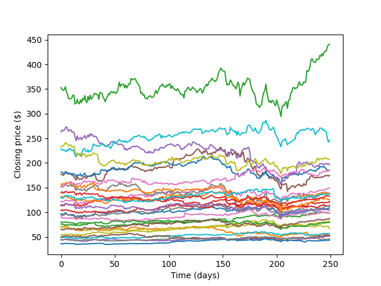
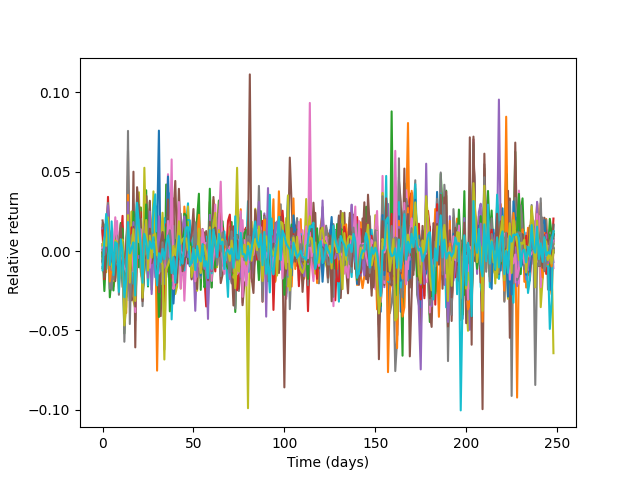
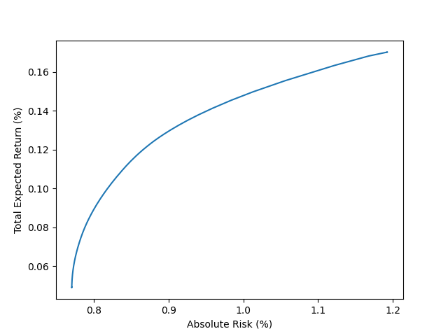
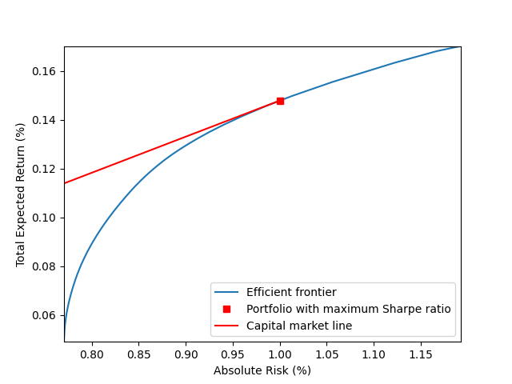
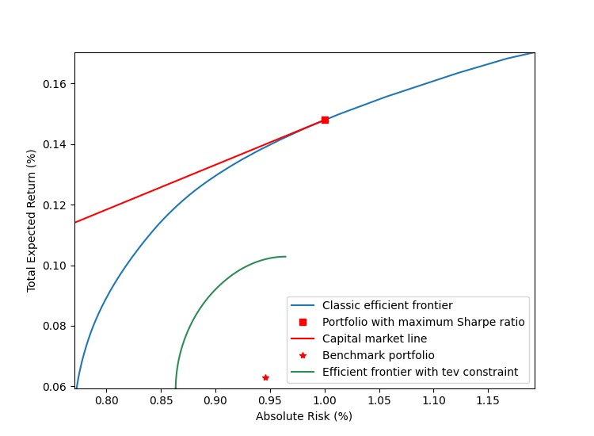

# Quadratically constrained quadratic programming and its applications in portfolio optimization

# Correct Rendering of this notebook
This file has a lot of Latex and GitHub currently cannot render it on Markdown files. [Here](https://numericalalgorithmsgroup.github.io/NAGJavaExamples/QCQP/) you can read it clearly.

The source of this example can be found [here](https://github.com/numericalalgorithmsgroup/NAGJavaExamples/blob/main/QCQP/portfolioOptimizationQCQP.java).

# Introduction

Quadratically constrained quadratic programming (QCQP) is a type of optimization problem in which both the objective function and the constraints involve quadratic functions. A general QCQP problem has the following form

$$
\begin{equation}
\begin{array}{ll}
\underset{x\in\Re^n}{\mbox{minimize}} &  \frac{1}{2}x^TP_0x+q_0^Tx+r_0\\[0.6ex]
\mbox{subject to} & \frac{1}{2}x^TP_ix+q_i^Tx+r_i\leq0,\quad i=1,\ldots,p.
\end{array}
\end{equation}
$$

It appears in applications such as modern portfolio theory, machine learning, engineering and control. Convex QCQP is usually handled through conic optimization, or, more precisely, second-order cone programming (SOCP) due to its computational efficiency and ability to detect infeasibility. However, using SOCP to solve convex QCQP is nontrivial task which requires extra amount of effort to transform problem data and add auxiliary variables. In this notebook, we are going to demonstrate how to use the *NAG Optimization Modelling Suite* in the NAG Library to define and solve QCQP in portfolio optimization.

# Data Preparation

We consider daily prices for the 30 stocks in the DJIA from March 2018 to March 2019. In practice, the estimation of the mean return $$r$$ and covariance $$V$$ is often a nontrivial task. In this notebook, we estimate those entities using simple sample estimates.

```java
// Load stock price data from djia_close_price.csv
        String[] dateIndex = new String[0];
        Map<String, double[]> closePrice = new LinkedHashMap<>();
        try {
            BufferedReader reader = new BufferedReader(new FileReader(dataFile));

            String line = reader.readLine().substring(1);
            dateIndex = line.split(",");

            String[] data;
            String key;
            double[] values;

            while ((line = reader.readLine()) != null) {
                data = line.split(",");
                key = data[0];
                values = parseDoubleArr(Arrays.copyOfRange(data, 1, data.length));
                closePrice.put(key, values);
            }
            reader.close();

        } catch (FileNotFoundException e) {
            System.err.println("***FATAL: Can't find " + dataFile);
            System.exit(-2);
        } catch (IOException e) {
            System.err.println("***FATAL: Can't read " + dataFile + "\n" + e.getMessage());
        }

        int m = dateIndex.length;
        int n = closePrice.size();

        double[][] data = new double[m][n];
        i = 0;
        for (Map.Entry<String, double[]> entry : closePrice.entrySet()) {
            double[] tempA = entry.getValue();
            for (j = 0; j < m; j++) {
                data[j][i] = tempA[j];
            }
            i++;
        }
```

<br/>

<div style="text-align: center;">
    
</div>

For each stock $$i$$, we first estimate the $$j$$th daily relative return as

$$relative~return_{i,j} = \frac{closing~price_{i,j+1}-closing~price_{i,j}}{closing~price_{i,j}}.$$

```java
        // Relative return
        double[][] relRtn = new double[m - 1][n];
        for (j = 0; j < m - 1; j++) {
            for (i = 0; i < n; i++) {
                relRtn[j][i] = (data[j + 1][i] - data[j][i]) / data[j][i];
            }
        }
```
<br/>

<div style="text-align: center;">
    
</div>

Simply take arithmetic mean of each column of relative return to get mean return $$r$$ for each stock, followed by estimating covariance $$V$$ using numpy.

```java
        // Mean return
        double[] r = new double[n];
        for (j = 0; j < n; j++) {
            double sum = 0;
            for (i = 0; i < m - 1; i++) {
                sum += relRtn[i][j];
            }
            r[j] = sum;
            r[j] /= m - 1;
        }

        // Covariance matrix
        G02BX g02bx = new G02BX();
        String weight = "U";
        n = relRtn.length;
        m = relRtn[0].length;
        int ldx = n;
        double[] x1d = convert2DTo1D(relRtn);
        double[] wt = new double[0];
        double[] xbar = new double[m];
        double[] std = new double[m];
        int ldv = m;
        double[] v1d = new double[ldv * m];
        double[] r1d = new double[ldv * m];
        int ifail = 0;
        g02bx.eval(weight, n, m, x1d, ldx, wt, xbar, std, v1d, ldv, r1d, ifail);

        double[][] V = convert1DTo2D(v1d, m);
```

# Classic Mean-Variance Model
## Efficient Frontier

One of the major goals of portfolio management is to achieve a certain level of return under a specific risk measurement. Here we demonstrate how to use NAG Library to build efficient frontier by solving classical Markowitz model with long-only constraint (meaning, buy to hold and short selling is not allowed):

$$
\begin{equation}\label{MV_model}
\begin{array}{ll}
\underset{x\in\Re^n}{\mbox{minimize}} & -r^Tx+\mu x^TVx\\[0.6ex]
\mbox{subject to} & e^Tx = 1,\\[0.6ex]
     & x\geq0,
\end{array}
\end{equation}
$$

where $$e\in\Re^n$$ is vector of all ones and $$\mu$$ is a scalar controling trade-off between return and risk. Note one could build the efficient frontier by varying $$\mu$$ from $$0$$ to a certain value.

```java
int itemsDiagLength = V.length;
        int itemsAboveDiagLength = (int) (Math.pow(itemsDiagLength, 2) - itemsDiagLength) / 2 + itemsDiagLength;
        int[] irowq = new int[itemsAboveDiagLength];
        int[] icolq = new int[itemsAboveDiagLength];
        double[] vVal = new double[itemsAboveDiagLength];
        int c = 0;
        // Input for quadratic objective
        // Sparsity pattern of upper triangular V
        for (i = 0; i < V.length; i++) {
            for (j = i; j < V[0].length; j++) {
                vVal[c] = V[i][j];
                irowq[c] = i + 1;
                icolq[c] = j + 1;
                c++;
            }
        }

        n = closePrice.size();
        // Sparsity pattern of r, which is actually dense in this application
        int[] idxr = new int[n];
        for (i = 0; i < n; i++) {
            idxr[i] = i + 1;
        }

        // Input for linear constraint: e'x = 1
        int[] irowa = new int[n];
        int[] icola = new int[n];
        double[] a = new double[n];
        double[] bl = new double[1];
        double[] bu = new double[1];
        double[] blx = new double[n];
        double[] bux = new double[n];

        Arrays.fill(irowa, 1);
        for (i = 0; i < n; i++) {
            icola[i] = i + 1;
        }
        Arrays.fill(a, 1.0);
        bl[0] = 1.0;
        bu[0] = 1.0;

        // Input for bound constraint: x >= 0
        Arrays.fill(blx, 0.0);
        Arrays.fill(bux, 1.0e20);
```

The input data is ready, we can easily build the efficient frontier as follows.

```java
// Set step for mu
        int step = 2001;

        // Initialize output data: absolute risk and return
        ArrayList<Double> abRisk = new ArrayList<>();
        ArrayList<Double> abRtn = new ArrayList<>();

        int mu;
        long handle = 0;
        double[] q = new double[vVal.length];
        int idqc;
        double[] invertSignR = invertSignVector(r);
        double[] x = new double[n];
        double[] u = new double[0];
        double[] uc = new double[0];
        double[] rinfo = new double[100];
        double[] stats = new double[100];
        int[] iuser = new int[2];
        double[] ruser = new double[1];
        long cpuser = 0;
        double[][] x2d;
        double[][] VX;
        double[][] XVX;
        double[][] r2d;
        double[][] RX;

        for (mu = 0; mu < step; mu++) {
            ifail = 0;

            // Create problem handle
            e04ra.eval(handle, n, ifail);
            handle = e04ra.getHANDLE();

            // Set quadratic objective function
            // In qcqp standard form q should be 2*mu*V
            for (i = 0; i < q.length; i++) {
                q[i] = 2.0 * mu * vVal[i];
            }

            idqc = -1;
            e04rs.eval(handle, 0.0, nonZeroLength(invertSignR), idxr, invertSignR, nonZeroLength(q), irowq, icolq, q,
                    idqc, ifail);

            // Set linear constraint e'x = 1
            e04rj.eval(handle, bl.length, bl, bu, nonZeroLength(a), irowa, icola, a, 0, ifail);

            // Set bound constraint
            e04rh.eval(handle, n, blx, bux, ifail);

            // set options
            e04zm.eval(handle, "Print Options = NO", ifail);
            e04zm.eval(handle, "Print Level = 1", ifail);
            e04zm.eval(handle, "Print File = -1", ifail);
            e04zm.eval(handle, "SOCP Scaling = A", ifail);

            // Call socp interior point solver
            ifail = 1;
            e04pt.eval(handle, n, x, 0, u, 0, uc, rinfo, stats, monit, iuser, ruser, cpuser, ifail);

            ifail = e04pt.getIFAIL();
            if (ifail == 0) {
                // Compute risk and return from the portfolio
                x2d = convert1DTo2D(x, x.length);
                VX = multiplyMatrices(V, x2d);
                XVX = multiplyMatrices(invertRowColMatrix(x2d), VX);

                abRisk.add(Math.sqrt(XVX[0][0]));

                r2d = convert1DTo2D(r, r.length);
                RX = multiplyMatrices(invertRowColMatrix(r2d), x2d);

                abRtn.add(RX[0][0]);
            }

            // Destroy the handle:
            e04rz.eval(handle, ifail);
            handle = e04rz.getHANDLE();
        }
```

<br/>

<div style="text-align: center;">
    
</div>

## Maximizing the Sharpe ratio

The Sharpe ratio is defined as the ratio of return of portfolio and standard deviation of the portfolio's excess return. It is usually used to measure the efficiency of a portfolio. Find the most efficient portfolio is equivalent to solve the following optimization problem.

$$
\begin{equation}\label{eq:sr_model}
\begin{array}{ll}
\underset{x\in\Re^n}{\mbox{minimize}} & \frac{\sqrt{x^TVx}}{r^Tx}\\[0.6ex]
\mbox{subject to} & e^Tx = 1,\\[0.6ex]
     & x\geq0.
\end{array}
\end{equation}
$$

By replacing $$x$$ with $$\frac{y}{\lambda}, \lambda\gt0$$, model $$(\ref{eq:sr_model})$$ is equivalent to

$$
\begin{equation}\label{sr_model_eq}
\begin{array}{ll}
\underset{y\in\Re^n, \lambda\in\Re}{\mbox{minimize}} & y^TVy\\[0.6ex]
\mbox{subject to} & e^Ty = \lambda,\\[0.6ex]
     & r^Ty=1, \\
     & y\geq0, \\
     & \lambda\geq0.
\end{array}
\end{equation}
$$

Problem $$(\ref{sr_model_eq})$$ is similar to problem $$(\ref{MV_model})$$ in the sense that they both have a quadratic objective function and linear constraints.

```java
// Input for linear constraint: e'y = lambda
        irowa = new int[(n + 1) + n];
        icola = new int[(n + 1) + n];
        a = new double[(n + 1) + n];
        bl = new double[2];
        bu = new double[2];
        blx = new double[n + 1];
        bux = new double[n + 1];

        Arrays.fill(irowa, 0, n + 1, 1);
        for (i = 0; i <= n; i++) {
            icola[i] = i + 1;
        }
        Arrays.fill(a, 0, n, 1.0);
        a[n] = -1.0;
        bl[0] = 0.0;
        bu[0] = 0.0;

        // Input for linear constraint: r'y = 1
        Arrays.fill(irowa, n + 1, irowa.length, 2);
        for (i = 0; i < n; i++) {
            icola[(n + 1) + i] = i + 1;
        }
        for (i = 0; i < n; i++) {
            a[(n + 1) + i] = r[i];
        }
        bl[1] = 1.0;
        bu[1] = 1.0;

        // Input for bound constraint: x >= 0
        Arrays.fill(blx, 0.0);
        Arrays.fill(bux, 1.0e20);
```

Now we can call the NAG SOCP solver as follows.

```java
        ifail = 0;

        // Create problem handle
        e04ra.eval(handle, n + 1, ifail);
        handle = e04ra.getHANDLE();

        // Set quadratic objective function
        // In qcqp standard form q should be 2*V
        for (i = 0; i < q.length; i++) {
            q[i] = 2.0 * vVal[i];
        }
        idqc = -1;
        e04rs.eval(handle, 0.0, 0, idxr, r, nonZeroLength(q), irowq, icolq, q, idqc, ifail);

        // Set linear constraints
        e04rj.eval(handle, bl.length, bl, bu, nonZeroLength(a), irowa, icola, a, 0, ifail);

        // Set bound constraint
        e04rh.eval(handle, blx.length, blx, bux, ifail);

        // Set options
        e04zm.eval(handle, "Print Options = NO", ifail);
        e04zm.eval(handle, "Print Level = 1", ifail);
        e04zm.eval(handle, "Print File = -1", ifail);
        e04zm.eval(handle, "SOCP Scaling = A", ifail);

        // Call socp interior point solver
        x = new double[n + 1];
        e04pt.eval(handle, n + 1, x, 0, u, 0, uc, rinfo, stats, monit, iuser, ruser, cpuser, ifail);

        x2d = convert1DTo2D(x, n);
        VX = multiplyMatrices(V, x2d);
        XVX = multiplyMatrices(invertRowColMatrix(x2d), VX);

        double srRisk = Math.sqrt(XVX[0][0]) / x[n];

        r2d = convert1DTo2D(r, n);
        RX = multiplyMatrices(invertRowColMatrix(r2d), x2d);

        double srRtn = RX[0][0] / x[n];

        double[] srX = new double[n];
        for (i = 0; i < srX.length; i++) {
            srX[i] = x[i] / x[n];
        }

        // Destroy the handle:
        e04rz.eval(handle, ifail);
        handle = e04rz.getHANDLE();
```

<br/>

<div style="text-align: center;">
    
</div>

# Portfolio optimization with tracking-error constraint

To avoid taking unnecessary risk when beating a benchmark, the investors commonly impose a limit on the volatility of the deviation of the active portfolio from the benchmark, which is also known as tracking-error volatility (TEV) $$\cite{J03}$$. The model to build efficient frontier in excess-return space is

$$
\begin{equation}\label{er_tev}
\begin{array}{ll}
\underset{x\in\Re^n}{\mbox{maximize}} & r^Tx\\
\mbox{subject to} & e^Tx = 0,\\
     & x^TVx\leq tev,
\end{array}
\end{equation}
$$

where $$tev$$ is a limit on the track-error. Roll $$\cite{R92}$$ noted that problem $$(\ref{er_tev})$$ is totally independent of the benchmark and leads to the unpalatable result that the active portfolio has systematically higher risk than the benchmark and is not optimal. Therefore, in this section we solve a more advanced model by taking absolute risk into account as follows.

$$
\begin{equation}\label{tev_model}
\begin{array}{ll}
\underset{x\in\Re^n}{\mbox{minimize}} & -r^Tx+\mu (x+b)^TV(x+b)\\
\mbox{subject to} & e^Tx = 0,\\
     & x^TVx\leq tev,\\
     & x+b\geq0,
\end{array}
\end{equation}
$$

where $$b$$ is a benchmark portfolio. In this demonstration, it is generated synthetically. Note here we use the same covariance matrix $$V$$ for tev and absolute risk measurement for demonstration purpose. In practice one could use different covariance matrices from different markets.

```java
// Generate a benchmark portfolio from efficient portfolio that maximize the
        // Sharpe ratio
        // Perturb x
        double[] b = new double[n];
        double sumB = 0;
        for (i = 0; i < b.length; i++) {
            b[i] = srX[i] + 1.0e-1;
            sumB += b[i];
        }

        // Normalize b
        for (i = 0; i < b.length; i++) {
            b[i] /= sumB;
        }

        // Set limit on tracking-error
        double tev = 0.000002;

        // Compute risk and return at the benchmark
        double[][] b2d = convert1DTo2D(b, n);
        double[][] VB = multiplyMatrices(V, b2d);
        double[][] BVB = multiplyMatrices(invertRowColMatrix(b2d), VB);

        double bRisk = Math.sqrt(BVB[0][0]);

        r2d = convert1DTo2D(r, n);
        double[][] RB = multiplyMatrices(invertRowColMatrix(r2d), b2d);

        double bRtn = RB[0][0];
```

<br/>

```java
        irowa = new int[n];
        icola = new int[n];
        a = new double[n];
        bl = new double[1];
        bu = new double[1];

        // Input for linear constraint: e'x = 0
        Arrays.fill(irowa, 1);
        for (i = 0; i < icola.length; i++) {
            icola[i] = i + 1;
        }
        Arrays.fill(a, 1.0);
        bl[0] = 0;
        bu[0] = 0;

        // Input for bound constraint: x >= -b
        blx = invertSignVector(b);
        Arrays.fill(bux, 1.0e20);
```

<br/>

```java
// Initialize output data: TEV risk and return
        ArrayList<Double> tevRisk = new ArrayList<>();
        ArrayList<Double> tevRtn = new ArrayList<>();

        double[] rMu = new double[n];
        double[][] Vb;
        double[] Vb1d;
        x = new double[n];
        double[] xb;
        double[][] xb2d;
        double[][] xbVxb;

        for (mu = 0; mu < step; mu++) {
            ifail = 0;

            // Create problem handle
            e04ra.eval(handle, n, ifail);
            handle = e04ra.getHANDLE();

            // Set quadratic objective function
            // In qcqp standard form q should be 2*mu*V
            for (i = 0; i < q.length; i++) {
                q[i] = 2.0 * mu * vVal[i];
            }
            Vb = multiplyMatrices(V, b2d);
            Vb1d = convert2DTo1D(Vb);
            for (i = 0; i < rMu.length; i++) {
                rMu[i] = 2.0 * mu * Vb1d[i] - r[i];
            }
            idqc = -1;
            e04rs.eval(handle, 0.0, nonZeroLength(rMu), idxr, rMu, nonZeroLength(q), irowq, icolq, q, idqc, ifail);

            // Set quadratic constraint
            // In qcqp standard form q should be 2*V
            for (i = 0; i < q.length; i++) {
                q[i] = 2.0 * vVal[i];
            }
            idqc = 0;
            e04rs.eval(handle, -tev, 0, idxr, rMu, nonZeroLength(q), irowq, icolq, q, idqc, ifail);

            // Set linear constraint e'x = 1
            e04rj.eval(handle, bl.length, bl, bu, nonZeroLength(a), irowa, icola, a, 0, ifail);

            // Set bound constraint
            e04rh.eval(handle, blx.length, blx, bux, ifail);

            // Set options
            e04zm.eval(handle, "Print Options = NO", ifail);
            e04zm.eval(handle, "Print Level = 1", ifail);
            e04zm.eval(handle, "Print File = -1", ifail);
            e04zm.eval(handle, "SOCP Scaling = A", ifail);

            // Call socp interior point solver
            // Mute warnings and do not count results from warnings
            ifail = -1;
            e04pt.eval(handle, n, x, 0, u, 0, uc, rinfo, stats, monit, iuser, ruser, cpuser, ifail);

            ifail = e04pt.getIFAIL();
            if (ifail == 0) {
                // Compute risk and return from the portfolio
                xb = addVectors(x, b);
                xb2d = convert1DTo2D(xb, xb.length);
                xbVxb = multiplyMatrices(invertRowColMatrix(xb2d), multiplyMatrices(V, xb2d));
                tevRisk.add(Math.sqrt(xbVxb[0][0]));

                tevRtn.add(multiplyMatrices(invertRowColMatrix(r2d), xb2d)[0][0]);
            }

            // Destroy the handle:
            e04rz.eval(handle, ifail);
            handle = e04rz.getHANDLE();
        }
```

<br/>

<div style="text-align: center;">
    
</div>

# Conclusion

In this notebook, we demonstrated how to use NAG Library to solve various quadratic models in portfolio optimization. Conic optimization is usually a good choice to solve convex QCQP. It is worth pointing out that the versatility of SOCP is not just limited to the QCQP models mentioned here. It covers a lot more problems and constraints. For example, DeMiguel et al. $$\cite{DGNU09}$$ discussed portfolio optimization with norm constraint, which can be easily transformed into an SOCP problem. We refer readers to the NAG Library documentation $$\cite{NAGDOC}$$ on SOCP solver and $$\cite{AG03, LVBL98}$$ for more details.

# References

[<a id="cit-J03" href="#call-J03">1</a>] Jorion Philippe, ``_Portfolio optimization with tracking-error constraints_'', Financial Analysts Journal, vol. 59, number 5, pp. 70--82,  2003.

[<a id="cit-R92" href="#call-R92">2</a>] Roll Richard, ``_A mean/variance analysis of tracking error_'', The Journal of Portfolio Management, vol. 18, number 4, pp. 13--22,  1992.

[<a id="cit-DGNU09" href="#call-DGNU09">3</a>] DeMiguel Victor, Garlappi Lorenzo, Nogales Francisco J <em>et al.</em>, ``_A generalized approach to portfolio optimization: Improving performance by constraining portfolio norms_'', Management science, vol. 55, number 5, pp. 798--812,  2009.

[<a id="cit-NAGDOC" href="#call-NAGDOC">4</a>] Numerical Algorithms Group, ``_NAG documentation_'',  2019.  [online](https://www.nag.com/numeric/fl/nagdoc_latest/html/frontmatter/manconts.html)

[<a id="cit-AG03" href="#call-AG03">5</a>] Alizadeh Farid and Goldfarb Donald, ``_Second-order cone programming_'', Mathematical programming, vol. 95, number 1, pp. 3--51,  2003.

[<a id="cit-LVBL98" href="#call-LVBL98">6</a>] Lobo Miguel Sousa, Vandenberghe Lieven, Boyd Stephen <em>et al.</em>, ``_Applications of second-order cone programming_'', Linear algebra and its applications, vol. 284, number 1-3, pp. 193--228,  1998.
