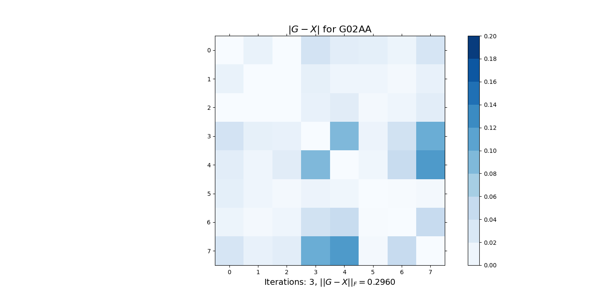

> ## Important Information
> To properly read the documentation click [here](https://numericalalgorithmsgroup.github.io/NAGJavaExamples/).

# Nearest Correlation Matrices

This notebook looks at computing *nearest correlation matrices* using the NAG Library for *Java*.

The source of this example can be found [here](https://github.com/numericalalgorithmsgroup/NAGJavaExamples/blob/main/nearest_correlation_matrices/NcmNag.java).

## Correlation Matrices

* An $$n$$ by $$n$$ matrix is a correlation matrix if:
  * it is symmetric
  * it has ones on the diagonal 
  * its eigenvalues are non-negative (positive semidefinite)           
  
  
  $$ \Large Ax = \lambda x, \quad x \neq 0$$


* The element in the $$i$$th row and $$j$$th column is the correlation between the $$i$$th and $$j$$th variables. This could be stock process, for example.

## Empirical Correlation Matrices 

* Empirical correlation matrices are often **not mathematically true** due to inconsistent or missing data.


* Thus we are required to find a true correlation matrix, where our input, $$G$$, is an approximate correlation matrix.


* In particular we seek the *nearest* correlation matrix, in most cases.

## Computing Correlation Matrices

* The vector $$p_i$$, the $$i$$th column of a matrix, $$P$$,  holds the $$m$$ observations of the $$i$$th variable, of which there are $$n$$. $$\bar{p}_i$$ is the sample mean. 


$$ \large S_{ij}=\frac{1}{m-1}(p_i - \bar{p}_i )^T(p_j - \bar{p}_j) $$

* $$S$$ is a covariance matrix, with $$S_{ij}$$ the covariance   between variables $$i$$ and $$j$$


* $$R$$ is the corresponding correlation matrix, given by: 

$$
\begin{align*} \large D_S^{1/2} & = \large \textrm{ diag}(s_{11}^{-1/2},s_{22}^{-1/2}, \ldots, s_{nn}^{-1/2}) \nonumber \\  &  \\
\large R & = \large D_S^{1/2} S D_S^{1/2} 
\end{align*}
$$


## Approximate Correlation Matrices

* Now, what if we don't have all observations for each variable?


* We compute each covariance with observations that are available for *both* the *i*th and *j*th variable.


* For example NAG routine **G02BB**.


* We then compute the correlation matrix as before.

# Missing Stock Price Example

* Prices for 8 stocks on the first working day of 10 consecutive months.


|    | Stock A  | Stock B   | Stock C  | Stock D   | Stock E | Stock F  | Stock G   | Stock H
| ---     | ---     | ---     | ---     | ---     | ---     | ---     | ---     | ---     |
| **Month 1**  | 59.875 | 42.734 | 47.938 | 60.359 | 54.016 | 69.625 | 61.500 | 62.125 |
| **Month 2**  | 53.188 | 49.000 | 39.500 |        | 34.750 |        | 83.000 | 44.500 |
| **Month 3**  | 55.750 | 50.000 | 38.938 |        | 30.188 |        | 70.875 | 29.938 |
| **Month 4**  | 65.500 | 51.063 | 45.563 | 69.313 | 48.250 | 62.375 | 85.250 |        |
| **Month 5**  | 69.938 | 47.000 | 52.313 | 71.016 |        | 59.359 | 61.188 | 48.219 |
| **Month 6**  | 61.500 | 44.188 | 53.438 | 57.000 | 35.313 | 55.813 | 51.500 | 62.188 |
| **Month 7**  | 59.230 | 48.210 | 62.190 | 61.390 | 54.310 | 70.170 | 61.750 | 91.080 |
| **Month 8**  | 61.230 | 48.700 | 60.300 | 68.580 | 61.250 | 70.340 |        |        |
| **Month 9**  | 52.900 | 52.690 | 54.230 |        | 68.170 | 70.600 | 57.870 | 88.640 |
| **Month 10** | 57.370 | 59.040 | 59.870 | 62.090 | 61.620 | 66.470 | 65.370 | 85.840 |


* We will use NaNs where there is missing data.

* So our $$P = \left[p_1, p_2, \ldots, p_n \right]$$ is:


$$ 
P=\left[\begin{array}{rrrrrrrr}
   59.875 &  42.734 & {\color{blue}{47.938}} & {\color{blue}{60.359}} & 54.016 & 69.625 & 61.500 & 62.125 \\
   53.188 & 49.000 & 39.500 & \textrm{NaN} & 34.750 & \textrm{NaN} & 83.000 & 44.500 \\
   55.750 & 50.000 & 38.938 & \textrm{NaN} & 30.188 & \textrm{NaN} & 70.875 & 29.938 \\
   65.500 & 51.063 & {\color{blue}{45.563}} & {\color{blue}{69.313}} & 48.250 & 62.375 & 85.250  & \textrm{NaN} \\
   69.938 & 47.000 & {\color{blue}{52.313}} & {\color{blue}{71.016}} & \textrm{NaN} & 59.359 & 61.188 & 48.219 \\
   61.500 & 44.188 &  {\color{blue}{53.438}} & {\color{blue}{57.000}} & 35.313 & 55.813 & 51.500 & 62.188 \\
   59.230 & 48.210 & {\color{blue}{62.190}} & {\color{blue}{61.390}} & 54.310 & 70.170 & 61.750 &
   91.080 \\
   61.230 & 48.700 & {\color{blue}{60.300}} & {\color{blue}{68.580}} & 61.250 & 70.340 & \textrm{NaN} & \textrm{NaN} \\
   52.900 & 52.690 & 54.230 &  \textrm{NaN} & 68.170 & 70.600 & 57.870 & 88.640 \\
   57.370 & 59.040 & {\color{blue}{59.870}} & {\color{blue}{62.090}} & 61.620 & 66.470 & 65.370 &
   85.840
\end{array}\right]. 
$$


* And to compute the covariance between the 3rd and 4th variables: 

$$
\begin{align*}  
\large v_1^T   & = \large [47.938, 45.563, 52.313, 53.438, 62.190, 60.300, 59.870]   \\
\large v_2^T   & = \large [60.359, 69.313, 71.016, 57.000, 61.390, 68.580, 62.090]   \\ 
S_{3,4}        & = \large \frac{1}{6} (v_1 - \bar{v}_1 )^T(v_2 - \bar{v}_2) 
\end{align*}
$$

* Let's compute this in Java.

### Initialize our *P* matrix of observations

```java
// Define a 2-d array and use Double.NaN to set elements as NaNs
double[][] P = new double[][] {
        { 59.875, 42.734, 47.938, 60.359, 54.016, 69.625, 61.500, 62.125 },
        { 53.188, 49.000, 39.500, Double.NaN, 34.750, Double.NaN, 83.000, 44.500 },
        { 55.750, 50.000, 38.938, Double.NaN, 30.188, Double.NaN, 70.875, 29.938 },
        { 65.500, 51.063, 45.563, 69.313, 48.250, 62.375, 85.250, Double.NaN },
        { 69.938, 47.000, 52.313, 71.016, Double.NaN, 59.359, 61.188, 48.219 },
        { 61.500, 44.188, 53.438, 57.000, 35.313, 55.813, 51.500, 62.188 },
        { 59.230, 48.210, 62.190, 61.390, 54.310, 70.170, 61.750, 91.080 },
        { 61.230, 48.700, 60.300, 68.580, 61.250, 70.340, Double.NaN, Double.NaN },
        { 52.900, 52.690, 54.230, Double.NaN, 68.170, 70.600, 57.870, 88.640 },
        { 57.370, 59.040, 59.870, 62.090, 61.620, 66.470, 65.370, 85.840 } };
```

### Compute the covariance, ignoring missing values

```java
public static double[][] cov_bar(double[][] P) {
    double[] xi, xj;
    boolean[] xib, xjb, notp;
    int n = P[0].length;
    double[][] S = new double[n][n];
    int notpFalseCount;
    
    for (int i = 0; i < n; i++) {
        // Take the ith column
        xi = getMatrixColumn(P, i);
        
        for (int j = 0; j < i + 1; j++) {
            // Take the jth column, where j <= i
            xj = getMatrixColumn(P, j);
            
            // Set mask such that all NaNs are true
            xib = getNanMask(xi);
            xjb = getNanMask(xj);
            
            notp = addBoolArrOr(xib, xjb);
            
            // S[i][j] = (xi - mean(xi)) * (xj - mean(xj))
            S[i][j] = matrixMaskedDot(vectorSubScalar(xi, vectorMaskedMean(xi, notp)),
                    vectorSubScalar(xj, vectorMaskedMean(xj, notp)), notp);
            
            // Take the sum over !notp to normalize
            notpFalseCount = 0;
            for (boolean b : notp) {
                if (!b) {
                    notpFalseCount++;
                }
            }
            S[i][j] = 1.0 / (notpFalseCount - 1) * S[i][j];
            S[j][i] = S[i][j];
        }
    }
    return S;
}
```

<br/>

```java
public static double[][] cor_bar(double[][] P) {
    double[][] S, D;
    S = cov_bar(P);
    // D = 1.0 / SQRT(S)
    D = getMatrixFromDiag(vectorRightDiv(vectorSqrt(getMatrixDiag(S)), 1.0));

    // S_ = S * D
    F01CK f01ck = new F01CK();
    double[] S_ = new double[S.length * S[0].length];
    double[] S1d = convert2DTo1D(S);
    double[] D1d = convert2DTo1D(D);
    int n = S.length;
    int p = n;
    int m = n;
    double[] z = new double[0];
    int iz = 0;
    int opt = 1;
    int ifail = 0;
    f01ck.eval(S_, S1d, D1d, n, p, m, z, iz, opt, ifail);
    
    // D_ = D * S_
    double[] D_ = new double[n * n];
    f01ck.eval(D_, D1d, S_, n, p, m, z, iz, opt, ifail);
    
    return convert1DTo2D(D_, n);
}
```

### Compute the *approximate* correlation matrix

```java
double[][] G = cor_bar(P);
```

<br/>

```
The approximate correlation matrix
  1.0000  -0.3250   0.1881   0.5760   0.0064  -0.6111  -0.0724  -0.1589 
 -0.3250   1.0000   0.2048   0.2436   0.4058   0.2730   0.2869   0.4241 
  0.1881   0.2048   1.0000  -0.1325   0.7658   0.2765  -0.6172   0.9006 
  0.5760   0.2436  -0.1325   1.0000   0.3041   0.0126   0.6452  -0.3210 
  0.0064   0.4058   0.7658   0.3041   1.0000   0.6652  -0.3293   0.9939 
 -0.6111   0.2730   0.2765   0.0126   0.6652   1.0000   0.0492   0.5964 
 -0.0724   0.2869  -0.6172   0.6452  -0.3293   0.0492   1.0000  -0.3983 
 -0.1589   0.4241   0.9006  -0.3210   0.9939   0.5964  -0.3983   1.0000 
```

### Compute the eigenvalues of our (indefinite) *G*.

* We see below that our matrix $$G$$ is not a mathematically true correlation matrix.

```java
F08NA f08na = new F08NA();
String jobvl = "N";
String jobvr = "N";
int n = G[0].length;
double[] G1d = convert2DTo1D(G);
int lda = G.length;
double[] wr = new double[n];
double[] wi = new double[n];
int ldvl = 1;
double[] vl = new double[ldvl];
int ldvr = 1;
double[] vr = new double[ldvr];
int lwork = 3 * n;
double[] work = new double[lwork];
int info = 0;
f08na.eval(jobvl, jobvr, n, G1d, lda, wr, wi, vl, ldvl, vr, ldvr, work, lwork, info);
Arrays.sort(wr);
```

<br/>

```
Sorted eigenvalues of G:  -0.2498  -0.0160   0.0895   0.2192   0.7072   1.7534   1.9611   3.5355 
```

# Nearest Correlation Matrices

* Our problem now is to solve:


$$ 
\large  
\min \frac{1}{2} \| G-X \|^2_F = 
\min \frac{1}{2}  \sum_{i=1}^{n} \sum_{i=1}^{n} 
\left| G(i,j)-X(i,j) \right| ^2 
$$


* In order to find $$X$$, a true correlation matrix, where $$G$$ is an approximate correlation matrix.


* An algorithm by Qi and Sun (2006), applies an inexact Newton method to a dual (unconstrained) formulation of this problem.


* Improvements were suggested by Borsdorf and Higham (2010 MSc).


* It is globally and quadratically (fast!) convergent.


* This is implemented in NAG routine **G02AA**.

## Using G02AA to compute the nearest correlation matrix in the Frobenius norm

```java
// Call NAG routine G02AA and print the result
G02AA g02aa = new G02AA();
G1d = convert2DTo1D(G);
n = G.length;
int ldg = n;
int ldx = n;
double errtol = 0.0;
int maxits = 0;
int maxit = 0;
double[] X1d = new double[ldx * n];
int iter = 0;
int feval = 0;
double nrmgrd = 0.0;
int ifail = 0;
g02aa.eval(G1d, ldg, n, errtol, maxits, maxit, X1d, ldx, iter, feval, nrmgrd, ifail);

double[][] X = convert1DTo2D(X1d, ldx);
iter = g02aa.getITER();
```

<br/>

```
Nearest correlation matrix
  1.0000  -0.3112   0.1889   0.5396   0.0268  -0.5925  -0.0621  -0.1921 
 -0.3112   1.0000   0.2050   0.2265   0.4148   0.2822   0.2915   0.4088 
  0.1889   0.2050   1.0000  -0.1468   0.7880   0.2727  -0.6085   0.8802 
  0.5396   0.2265  -0.1468   1.0000   0.2137   0.0015   0.6069  -0.2208 
  0.0268   0.4148   0.7880   0.2137   1.0000   0.6580  -0.2812   0.8762 
 -0.5925   0.2822   0.2727   0.0015   0.6580   1.0000   0.0479   0.5932 
 -0.0621   0.2915  -0.6085   0.6069  -0.2812   0.0479   1.0000  -0.4470 
 -0.1921   0.4088   0.8802  -0.2208   0.8762   0.5932  -0.4470   1.0000 
```

<br/>

```java
jobvl = "N";
jobvr = "N";
n = X[0].length;
lda = X.length;
wr = new double[n];
wi = new double[n];
ldvl = 1;
vl = new double[ldvl];
ldvr = 1;
vr = new double[ldvr];
lwork = 3 * n;
work = new double[lwork];
info = 0;
f08na.eval(jobvl, jobvr, n, X1d, lda, wr, wi, vl, ldvl, vr, ldvr, work, lwork, info);
Arrays.sort(wr);
```

<br/>

```
Sorted eigenvalues of X:  -0.0000   0.0000   0.0380   0.1731   0.6894   1.7117   1.9217   3.4661 
```



# Weighting rows and columns of elements

* Now, we note that for Stocks A to C we have a complete set of observations.


$$
P=\left[\begin{array}{rrrrrrrr}
  {\color{blue}{59.875}} & {\color{blue}{42.734}} & {\color{blue}{47.938}} & 60.359 & 54.016 & 69.625 & 61.500 & 62.125 \\
   {\color{blue}{53.188}} & {\color{blue}{49.000}} & {\color{blue}{39.500}} & \textrm{NaN} &  34.750 & \textrm{NaN} & 83.000 & 44.500 \\
   {\color{blue}{55.750}} & {\color{blue}{50.000}} & {\color{blue}{38.938}} & \textrm{NaN} & 30.188 & \textrm{NaN} & 70.875 & 29.938 \\
   {\color{blue}{65.500}} & {\color{blue}{51.063}} & {\color{blue}{45.563}} & 69.313 & 48.250 & 62.375 & 85.250 & \textrm{NaN} \\
   {\color{blue}{69.938}} & {\color{blue}{47.000}} & {\color{blue}{52.313}} & 71.016 & \textrm{NaN} & 59.359 & 61.188 & 48.219 \\
   {\color{blue}{61.500}} & {\color{blue}{44.188}} & {\color{blue}{53.438}} & 57.000 & 35.313 & 55.813 & 51.500 & 62.188 \\
   {\color{blue}{59.230}} & {\color{blue}{48.210}} & {\color{blue}{62.190}} & 61.390 & 54.310 & 70.170 & 61.750 & 91.080 \\
   {\color{blue}{61.230}} & {\color{blue}{48.700}} & {\color{blue}{60.300}} & 68.580 & 61.250 & 70.340  & \textrm{NaN} & \textrm{NaN} \\
   {\color{blue}{52.900}} & {\color{blue}{52.690}} & {\color{blue}{54.230}} & \textrm{NaN} & 68.170 & 70.600 & 57.870 & 88.640 \\
   {\color{blue}{57.370}} & {\color{blue}{59.040}} & {\color{blue}{59.870}} & 62.090 & 61.620  &66.470 & 65.370 & 85.840
\end{array}\right].
$$


* Perhaps we wish to preserve part of the correlation matrix?


* We could solve the *weighted* problem, NAG routine **G02AB**


$$ \Large \|W^{\frac{1}{2}} (G-X) W^{\frac{1}{2}} \|_F$$ 


* Here $$W$$ is a diagonal matrix.


* We can also force the resulting matrix to be positive definite.

### Use G02AB to compute the nearest correlation matrix with row and column weighting

```java
// Define an arrray of weights
double[] W = new double[] { 10, 10, 10, 1, 1, 1, 1, 1 };

// Set up and call the NAG routine using weights and a minimum eigenvalue
G02AB g02ab = new G02AB();
G1d = convert2DTo1D(G);
ldg = G.length;
n = G[0].length;
String opt = "B";
double alpha = 0.001;
errtol = 0.0;
maxits = 0;
maxit = 0;
ldx = n;
X1d = new double[ldx * n];
iter = 0;
feval = 0;
nrmgrd = 0;
ifail = 0;
g02ab.eval(G1d, ldg, n, opt, alpha, W, errtol, maxits, maxit, X1d, ldx, iter, feval, nrmgrd, ifail);

X = convert1DTo2D(X1d, ldx);
iter = g02ab.getITER();
```

```java
jobvl = "N";
jobvr = "N";
n = X[0].length;
lda = X.length;
wr = new double[n];
wi = new double[n];
ldvl = 1;
vl = new double[ldvl];
ldvr = 1;
vr = new double[ldvr];
lwork = 3 * n;
work = new double[lwork];
info = 0;
f08na.eval(jobvl, jobvr, n, X1d, lda, wr, wi, vl, ldvl, vr, ldvr, work, lwork, info);
Arrays.sort(wr);
```

# Weighting Individual Elements

* Would it be better to be able to *weight individual elements* in our approximate matrix?


* In our example the top left 3 by 3 block of exact correlations, perhaps.


* Element-wise weighting means we wish to find the minimum of


$$ \Large \|H \circ(G-X) \|_F $$ 


* So individually $$h_{ij} \times (g_{ij} – x_{ij}).$$


* However, this is a more “difficult” problem, and more computationally expensive. 


* This is implemented in the NAG routine **G02AJ**.

### Use G02AJ to compute the nearest correlation matrix with element-wise weighting

```java
// Set up a matrix of weights
n = P[0].length;
double[][] H = new double[n][n];
for (int i = 0; i < n; i++) {
    for (int j = 0; j < n; j++) {
        if ((i < 3) && (j < 3)) {
            H[i][j] = 100.0;
        } else {
            H[i][j] = 1;
        }
    }
}
```

```java
// Call the NAG routine specifying a minimum eigenvalue
G02AJ g02aj = new G02AJ();
G1d = convert2DTo1D(G);
ldg = G.length;
n = G[0].length;
alpha = 0.001;
double[] H1d = convert2DTo1D(H);
int ldh = H.length;
errtol = 0;
maxit = 0;
ldx = n;
X1d = new double[ldx * n];
iter = 0;
double norm2 = 0;
ifail = 0;
g02aj.eval(G1d, ldg, n, alpha, H1d, ldh, errtol, maxit, X1d, ldx, iter, norm2, ifail);

X = convert1DTo2D(X1d, ldx);
iter = g02aj.getITER();
```

```java
jobvl = "N";
jobvr = "N";
n = X[0].length;
lda = X.length;
wr = new double[n];
wi = new double[n];
ldvl = 1;
vl = new double[ldvl];
ldvr = 1;
vr = new double[ldvr];
lwork = 3 * n;
work = new double[lwork];
info = 0;
f08na.eval(jobvl, jobvr, n, X1d, lda, wr, wi, vl, ldvl, vr, ldvr, work, lwork, info);
Arrays.sort(wr);
Arrays.sort(wi);
```

# Fixing a Block of Elements

* We probably really wish to *fix* our leading block of true correlations, so it does not change at all.


* We have the NAG routine **G02AN**.


* This routine fixes a leading block, which we require to be positive definite.


* We apply the *shrinking algorithm* of Higham, Strabić and Šego. The approach is **not** computationally expensive.


* What we find is the smallest α, such that *X* is a true correlation matrix:


$$ \large X =  \alpha \left( 
\begin{array}{ll}G_{11} & 0 \\ 0 & I \end{array} \right) +(1-\alpha)G, 
\qquad G = \left( 
\begin{array}{ll} G_{11} & G_{12} \\ G_{12}^T & G_{22} \end{array} 
\right) 
$$


* $$G_{11}$$ is the leading $$k$$ by $$k$$ block of the approximate correlation matrix that we wish to fix.


* $$\alpha$$ is in the interval $$[0,1]$$.

### Use G02AN to compute the nearest correlation matrix with fixed leading block

```java
// Call the NAG routine fixing the top 3-by-3 block
G02AN g02an = new G02AN();
G1d = convert2DTo1D(G);
ldg = G.length;
n = G[0].length;
int k = 3;
errtol = 0;
double eigtol = 0;
ldx = n;
X1d = new double[ldx * n];
alpha = 0.001;
iter = 0;
double eigmin = 0;
norm2 = 0;
ifail = 0; 
g02an.eval(G1d, ldg, n, k, errtol, eigtol, X1d, ldx, alpha, iter, eigmin, norm2, ifail);

X = convert1DTo2D(X1d, ldx);
iter = g02an.getITER();
alpha = g02an.getALPHA();
```

```java
jobvl = "N";
jobvr = "N";
n = X[0].length;
lda = X.length;
wr = new double[n];
wi = new double[n];
ldvl = 1;
vl = new double[ldvl];
ldvr = 1;
vr = new double[ldvr];
lwork = 3 * n;
work = new double[lwork];
info = 0;
f08na.eval(jobvl, jobvr, n, X1d, lda, wr, wi, vl, ldvl, vr, ldvr, work, lwork, info);
Arrays.sort(wr);
```

# Fixing Arbitrary Elements

* The routine **G02AP** fixes arbitrary elements by finding the smallest α, such that *X* is a true correlation matrix in:


$$ X = \large \alpha T+(1-\alpha)G, \quad T = H \circ G, \quad h_{ij} \in [0,1] $$


* A "1" in *H* fixes corresponding elements in *G*.


* $$0 < h_{ij} < 1$$ weights corresponding element in *G*.


* $$\alpha$$ is again in the interval $$[0,1]$$.

## Alternating Projections

* First method proposed to solve our original problem, however, it is very slow.


* The idea is we alternate projecting onto two sets, which are:
   * the set of smeidefinite matrices (S1), and 
   * matrices with unit diagonal (s2) 


* We do this until we converge on a matrix with both properties.


## Alternating Projections with Anderson Acceleration


* A new approach by Higham and Strabić uses *Anderson Acceleration*, and makes the method worthwhile.


* In particular, we will be able to fix elements whilst finding the nearest true correlation matrix in the Frobenius norm.


* Our projections are now:
   * the set of (semi)definite matrices with some minimum eigenvalue, and 
   * matrix with elements $$G_{i,j}$$ for some given indices $$i$$ and $$j$$


* To appear in a future NAG Library.

# More on using the NAG Library for *Java*:


**https://www.nag.com/content/nag-library-for-java** 
